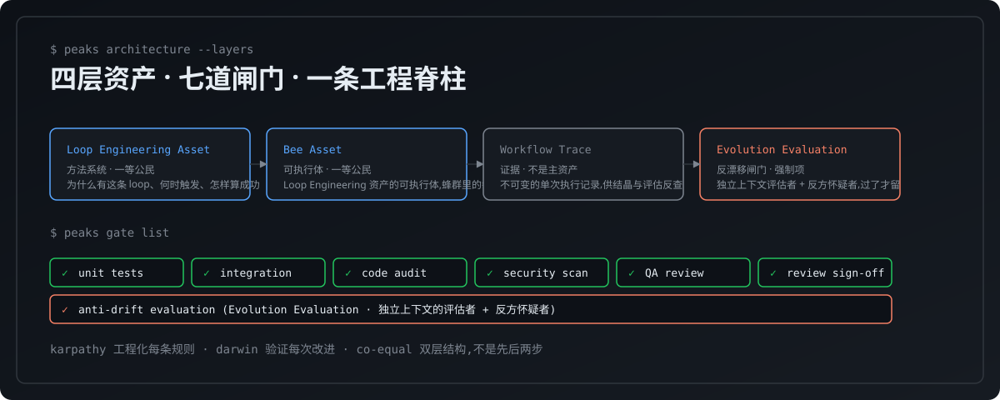
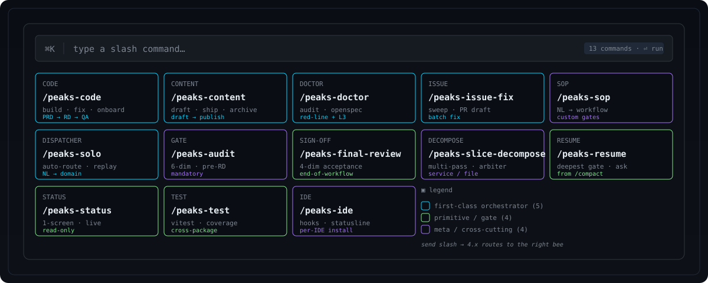
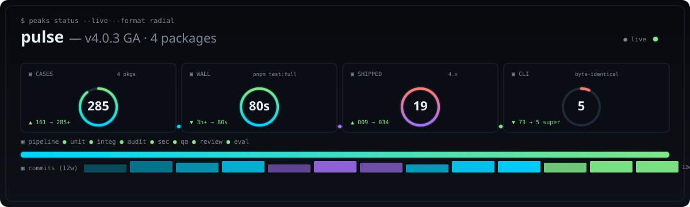
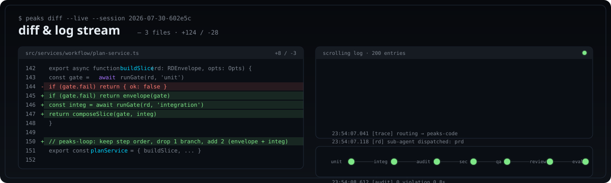
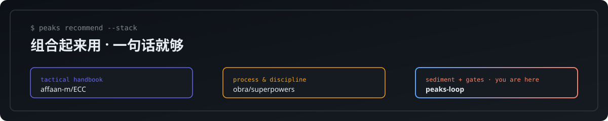
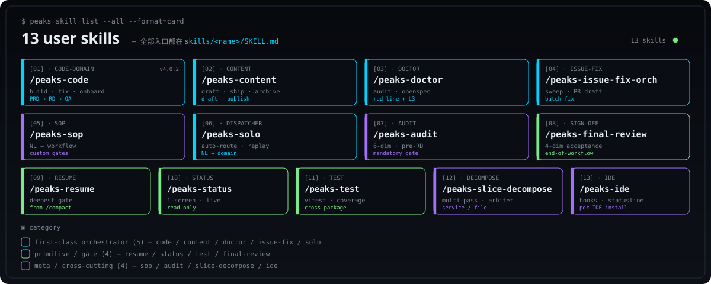
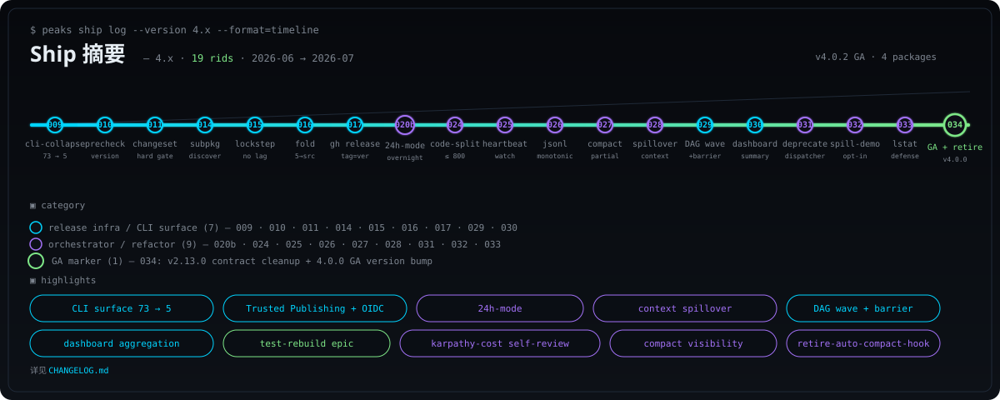

<div align="center">

# peaks-loop

### 你说话,它替你跑完一整条工程流水线 —— 不止写代码,跑两次就沉淀成本地战术。

[](https://www.npmjs.com/package/peaks-loop)
[](https://github.com/SquabbyZ/peaks-loop/actions/workflows/publish.yml)
[](https://github.com/SquabbyZ/peaks-loop/actions/workflows/ci.yml)
[](./LICENSE)
[](https://www.npmjs.com/package/peaks-loop)
[](#status)
[](https://github.com/SquabbyZ/peaks-loop/stargazers)

[English](./README-en.md) · **简体中文**

</div>

<p align="center">
  
</p>

---

## 它是什么

peaks-loop 是一个 **Loop Engineering 结晶系统**,不是工作流工具 —— 你跑过的工作里,沉淀下来的不是「流程」,是一套**可被 karpathy 风格工程化、又被 darwin 风格独立验证**的 Loop Engineering 方法资产。

| 资产层 | 角色 | 一句话 |
| --- | --- | --- |
| **Loop Engineering 资产** | 方法系统,一等公民 | 回答「为什么有这条 loop、何时触发、怎样算成功、如何改进」 |
| **Bee 资产** | 可执行体,一等公民 | Loop Engineering 资产的可执行体,蜂群里的每只 bee |
| **Workflow Trace (执行轨迹)** | 证据,**不是**主资产 | 不可变的单次执行记录,供结晶与评估反查,不是用户对外的产品 |
| **Evolution Evaluation (反漂移)** | 反漂移闸门,强制项 | 每次改进都要有独立上下文的评估者 + 反方怀疑者,过了才留,不过就回滚 |

- **工程化每条规则 = karpathy 风格 · 验证每次改进 = darwin 风格** —— 两条缺一不可。砍掉 karpathy,原则没人写清;砍掉 darwin,改得对不对没人验。这一对是 co-equal 的双层结构,不是先后两步。
- `/peaks-code` 是 **code-domain** 长任务 Loop Engineering 编排器,不是通用编排器;非代码域(`peaks-content` / `peaks-doctor` / `peaks-issue-fix-orchestrator` / `peaks-sop`)都是独立的 `peaks-*` 蜂,不是 `peaks-code` 的子类。
- 跑两次稳定就沉淀成本地战术(bee);跑翻车的会让你重定义。bee 跟着你的口味长。

<p align="center">
  
</p>

---

## 30 秒上手

```bash
npm i -g peaks-loop
```

装好之后,在你已经用的 **Claude Code** 或 **Z Code** 对话框里发一条**显式命令**(必须以斜杠开头,才会触发 peaks-loop):

```
/peaks-code 帮我熟悉下当前的项目
```

剩下的就交给 peaks-loop —— 它会按这条命令的语义判断该走哪一域,用对应的编排器拆工序,一道门一道门跑,**坏在哪道停在哪道**,中间不会扔半截给你。

其他常用的显式命令:

```
/peaks-content                 帮我把今天这篇推文写完发出
/peaks-doctor                  帮我体检一下这个仓库
/peaks-issue-fix-orchestrator  帮我把 upstream 的 30 个 open issue 修一批
/peaks-sop                     帮我把团队的发布流程沉淀成 SOP
/peaks-solo                    这套打法以后还会用,沉淀成本地战术
/peaks-solo                    按上次那样再跑一次
```

<sub>📦 其他 AI 编程工具适配中,欢迎共建 → [GitHub Issues](https://github.com/SquabbyZ/peaks-loop/issues) 提适配请求 / PR。</sub>

不需要记 CLI、不需要写 manifest、不需要切到第二个终端。**斜杠命令一发,后面的活它替你跑完。**

---

## 它能为你做什么

代码、内容、项目健康、issue 修复、自定义工作流 —— **4.x 已经覆盖五条域**,每条域都有专门编排器,按"门禁不通过就停"的纪律一条一条跑。

<p align="center">
  
</p>

| 域 | 你发这条命令 | 它会做什么 |
| --- | --- | --- |
| 💻 **代码域 (code-domain) only** | `/peaks-code 帮我实现这个功能` | PRD → RD → 实现 → QA → UI → 切片,跑完交你拍板 |
| 💻 **代码域 (code-domain) only** | `/peaks-code 这个 bug 帮我修一下` | 复现 → 改 → review → 测试,同日 ship |
| 📝 **内容** | `/peaks-content 帮我把这篇推文写出来再发` | 草稿 → 编辑 → 调性检查 → 发布 → 归档,中间不跳步 |
| 🩺 **项目健康** | `/peaks-doctor 帮我体检一下这个仓库` | 红线审计 + L3 doctor 检查 + 转 OpenSpec,坏在哪道停在哪道 |
| 🐛 **批量修 issue** | `/peaks-issue-fix-orchestrator 帮我把 upstream 的 30 个 open issue 修一批` | 调研 → 分类 → 参考 PR → 逐个修复 + commit + PR 草稿 |
| 📋 **自定义工作流** | `/peaks-sop 帮我把团队的发布流程沉淀成 SOP` | 自然语言描述 → 自动生成 + 校验 + 注册成可执行的 SOP |
| 🔁 **跑过一次再来** | `/peaks-solo 按上次那样再跑一次` | 调出你已经沉淀好的战术,自动复跑 |
| 🆕 **接手陌生仓库** | `/peaks-code 这是新仓库,先带我过一遍` | 摸清结构、识别风险点、给一个上手顺序 |
| 🧠 **沉淀自己的打法** | `/peaks-solo 这套打法以后还会用,沉淀一下` | 变成你本地常驻的战术,下次说"跑那只"就行 |
| 🧪 **开闸审计** | `/peaks-audit` | 6 维审计,RD/QA 前的强制入口 |
| ✅ **4 维验收** | `/peaks-final-review` | 功能/问题/不引入新 bug/不破坏 |
| 🔌 **IDE 适配** | `/peaks-ide` | hooks + statusline + handle |
| ⏯ **从断点续跑** | `/peaks-resume` | 扫最深完成的门,AskUserQuestion |
| 🔬 **切片拆解** | `/peaks-slice-decompose` | 多 pass + 跨 pass 边 + 仲裁 |

每一条路,**一条斜杠命令**就能开跑。

---

## 为什么大家会选它

- **自然语言即界面** —— 你不学 CLI、不背命令。**用一条斜杠命令(比如 `/peaks-code xxx`)** 显式触发到对应编排器,后面说什么都行。LLM 替你跟 peaks-loop 跑命令。
- **门禁真挡事,不是装饰** —— 285+ 测试用例(4 packages 全绿)、QA 闸口、review 验收默认全开。**审计不通过就停,QA 没过就停**。
- **跑过的事会变成本地战术(bee)** —— 沉淀下来的 loop engineering 落到你本地的 `~/.peaks/` 池子里,跑两次稳定就自动晋升;跑翻车的会让你重新定义。**下次说"跑那只"整套流程自动就位**,你那几只战术会跟着你的口味长。
- **搭在你已经用的工具上** —— 不是新发明一个 AI CLI,而是架在 **Claude Code** 和 **Z Code** 之上。不抢你的 shell、不抢你的 prompt、不抢你的 IDE。其他工具适配中,欢迎共建。
- **你拍板,它执行** —— 影响资产的决策都给你选;其余的它自己跑。**0 学习成本,1 分钟上手。**

---

## 装上以后的几道闸门

| 闸门 | 默认状态 | 用来挡什么 |
| --- | --- | --- |
| 单元测试 / 集成测试 | ✅ 开 | 代码层面的回归 |
| 代码审计 (lint / prose / type) | ✅ 开 | 写法与意图漂移 |
| 安全扫描 | ✅ 开 | 凭据、SSRF、注入、危险 IO |
| QA 复核 | ✅ 开 | 任务级闸门,坏在哪道停在哪道 |
| review 验收 | ✅ 开 | 改完不立刻出门,review 通过才出门 |
| 反漂移评估 (Evolution Evaluation) | ✅ 开 | 改进必须过独立评估者 + 反方怀疑者,过不了就回滚 |

**所有闸门默认开,你想关哪一道才需要单独说。**

---

## 当前状态 · 4.0.17

<p align="center">
  
</p>

<p align="center">
  
</p>

| | |
| --- | --- |
| **最新版本** | [](https://www.npmjs.com/package/peaks-loop) — 4.0.17(2026-08-07) |
| **覆盖域** | 代码(`peaks-code`) · 内容(`peaks-content`) · 项目健康(`peaks-doctor`) · 批量修 issue(`peaks-issue-fix-orchestrator`) · 自定义 SOP(`peaks-sop`) · 通用原语(`peaks-solo` 分诊 / `peaks-resume` 续 / `peaks-status` 看 / `peaks-test` 测 / `peaks-slice-decompose` 切片) |
| **沉淀池** | `~/.peaks/` 本地池 · 跑两次自动晋升成 bee · 跑翻车让你重定义 · bee 跟着你的口味长 |
| **测试套件** | 285+ cases · 4 packages (peaks-loop / peaks-loop-mut / peaks-loop-shared-channel / peaks-loop-shared) · 0 timeouts · 14 BDD caller-binding coverage |
| **适配 IDE** | ✅ Claude Code · ✅ Z Code · 🚧 Codex / Cursor / Trae / Tongyi Lingma / Hermes / OpenClaw / Qoder(适配中,欢迎共建) |
| **依赖运行时** | Node ≥ 20 |
| **License** | MIT |

### 4.0.17 这一波实打实修了什么(2026-08-07)

| Epic | 解决的事 | 怎么验 |
| --- | --- | --- |
| **Vitest worker cap(根因修)** | 完整套件 17 个 timeout 卡 30s;根因不是 bug,是 `pool:'forks'+fileParallelism:true` 没设 `maxWorkers`,16 核机器起 15 个 fork + 2 文件真实 `node` spawn = 8.8× 过载。`testTimeout` 算 wall clock,被 descheduled 的测试烧 30s 啥都不干。修 = `maxWorkers = floor(cpus/2)` + `PEAKS_VITEST_MAX_WORKERS` env override + 6-case drift guard。**17 timeout → 0,wall 383.67s → 360.40s,3/3 AC-1 runs 全 0 timeout。** | commit `ace1a03d` + guard test `tests/unit/vitest-concurrency-guard.test.ts` |
| **PRD-002b ESLint 严格化(no-magic-numbers)** | 切片 2 关闭 917 → 192 violations(-725);20 source files 把 140+ inline magic numbers 抽出成 named consts;`no-magic-numbers` 配置加 `ignore: [-1,0,1,2,100,1000]` + `ignoreArrayIndexes/ignoreDefaultValues`;7 BDD tests,31/31 lint tests PASS。Severity 保持 `warn` 不变(D5 no-touch-stockcode)。 | commits `d5ef17c1` + `0c3187c4` + 7 BDD tests |
| **Statusline `--now` 注入 + 24 spawns amortization** | 切片 1 根因 = test 用 `new Date().toISOString()` 写 lifecycle `updatedAt`,full-suite 并发下 subprocess 被 deschedule 几秒后才执行,10s 窗口过期 → C1 baseline fallback → 期望 `[████████]` 失败。修 = CLI 加 `--now <ms>`,test 共享 `TEST_NOW_MS` 锚定。**切片 7** 进一步把 24 个真实 `node dist/cli/index.js` spawn 换成 1 个 `beforeAll` IPC server,wall 216s → 29s(7.5× 加速),24/24 PASS。 | commit `3d6e4bc9` (含切片 1) + `44c42424` (切片 7) |
| **Complexity refactor(切片 3 A+B+C+D + 切片 4 bundle-reader rewrite)** | 切片 3 四阶段 refactor 关闭 357 → 330 complexity violations(goal ≤90,本波覆盖 ~7% 的高 cohort):spec-service parser 走 table-dispatch、slice-decompose FSM、project-context detectComponentLibrary 11 探测 dispatch;**切片 4** = bundle-reader full rewrite,5 violations → 1,public API preserved verbatim。 | commits `72ef798c` + `31160051` + `1ac6e56d` + `923be824` + `0603754d` + `6b27eb94` |
| **Type narrowing + max-lines 试点(切片 5+6)** | 切片 5 关 670 violations:667 phantom `no-explicit-any` config swap(ruleId 修复,类似 no-duplicate-imports 老坑)+ 3 real narrowing(`catch (error: any)` → `unknown` + `instanceof Error`)。切片 6 切 dispatch-record-writer.ts 4 个超长函数,4 → 0 in target file。两 slice 都证明 rule essentially exhausted 真比 memory 标注小一个数量级。 | commits `fbb43e9e` + `3d6e4bc9` (含) |
| **Mac auto-compact ESM 防 fake-green 5/5 验证** | 切片 8 audit-only:5 个 defenses (`readClaudeTranscriptFallback` / `readClaudeStatuslinePercent` / `presence-marker-detector` / `post-compact-detector` / `step-08-gate`) 全部 in-place,ESM `require()` 0 hits,legacy silent-catch blocks 已 explicit re-throw `ReferenceError` / `SyntaxError`。 | sediment `.peaks/memory/2026-08-07-mac-esm-defense-audit.md` |
| **Caller-binding 覆盖扩展(切片 9)** | 14 BDD tests 覆盖 5 gap categories:multi-tenant 隔离 / rotation 后 recovery / TTL freshness / rotation hygiene / primary-wins contract。`tests/unit/session/*` 从 51 → 65 tests。 | commit `823be8c4` + new file `tests/unit/session/caller-binding-slice-9-edge-cases.test.ts` |
| **Pre-publish 验证全过** | gate-cli-version ALIGNED(root 4.0.17 == shared CLI_VERSION 4.0.17),build-integrity OK,0 Co-Authored-By trailers。 | per `peaks-loop-publishing-critical-hard-rules` recipe |

| Epic | 解决的事 | 怎么验 |
| --- | --- | --- |
| **测试体系从零重建** | 旧 559 文件单测卡 3 小时跑不完;现 11 test files / 161 cases 单测已上线,加上子包测试与新增切片,全量 4 packages 285+ cases 全绿,`pnpm test:full` ~80s。删旧断言、写生产合约、4 维分拆(render/behavior/integration/a11y)。 | commit `f17aa377` → `1d6233bc` · `.peaks/memory/2026-07-30-test-rebuild-epic-sediment.md` |
| **Karpathy 评估成本自审** | LLM 在 1-2 个 slice 后不再"今天差不多了明天继续"——`karpathy-reviewer` 报 `costRatio`,>10 时 `peaks job karpathy-cost-check` 自动降级 `block`→`warn`。24h-mode 仍是 override。 | `peaks job karpathy-cost-check --review-file <path>` · 21 cases 单测 |
| **Compact 显性可见** | `peaks compact history` 给 LLM 看本次会话所有 compact 事件;`peaks statusline compact` 单行指示给 IDE 状态栏( `--` / `compact pending (0.85)` / `REDLINE 0.95` / `just compacted (0.92→?)`)。 | `auto-compact-orchestrator` append 到 `compact-history.jsonl` · 19 cases 单测 |
| **子包独立单测 + `pnpm test:full` 覆盖全 workspace** | `peaks-loop-mut` / `peaks-loop-shared-channel` 各自 4 维单测;`peaks-loop-shared` 0 file (passWithNoTests);root 镜像冗余删除。 | commit `593ffcdf` → `08e92d8f` · `pnpm test:full` 一次跑完 4 packages |
| **CLI surface 收敛(73 → 5 super-commands)** | 5 个 super-command(`peaks code / audit / doctor / openspec / release / release-pack`)替换 73 个 leaf command,byte-identical 契约保留,改动对外透明。 | rid-009 · 26 routing test |

---

## 强烈推荐 · 四个项目组合起来用

> **0 学习成本。** 这是组合起来用最大的好处 —— 不只是效果俱佳,更是因为这四个项目的**接口对齐到了"自然语言"**,你只需要说一句话,谁替你跑命令、按什么闸门、按什么战术手册,完全不用你记。

<p align="center">
  
</p>

| 角色 | 项目 | 一句话 |
| --- | --- | --- |
| **结晶与门禁** | [**peaks-loop**](https://github.com/SquabbyZ/peaks-loop) ← 你在这里 | loop engineering 结晶系统,装上就有 PRD/RD/QA/UI/SC/TXT 一整条工程链 + 沉淀 |
| **战术手册** | [affaan-m/ECC](https://github.com/affaan-m/ECC) | everything-claude-code:Claude Code 上能拿到的最好用的战术、技能、SOP 集合 |
| **代码理解** | [Egonex-AI/Understand-Anything](https://github.com/Egonex-AI/Understand-Anything) | 任意仓库,一句话读懂 —— 让 LLM 真正"理解"项目,而不是猜 |
| **流程与纪律** | [obra/superpowers](https://github.com/obra/superpowers) | brainstorming / TDD / debugging / code-review 等流程纪律,每条都自带硬退出条件 |

**用起来就一句话**:把上面三个仓库都 clone 到本地,peaks-loop 装上,剩下的交给 LLM —— 它会按需取用、按纪律守门、按战术落地、按需求沉淀。

### 致敬

peaks-loop 的两条工程脊柱直接来自这两个项目:

- [multica-ai/andrej-karpathy-skills](https://github.com/multica-ai/andrej-karpathy-skills) — 把"工程化每一条规则"刻进我们的方法层。
- [alchaincyf/darwin-skill](https://github.com/alchaincyf/darwin-skill) — 把"演化校验每一次改进"刻进我们的反漂移闸门。

---

## 开发者 · 24h 模式 / 批量工具

> **给 peaks-loop 项目维护者与「24h 模式」使用者** —— end-user 跳过这一段,继续看 FAQ 就够。

如果你的工作流跑到了 **24h 模式**(`peaks session 24h-mode` + `24H_ACTIVE`)、**批量 closure pass**、或任何需要从 LLM 主线程派生出一堆 `peaks request transition` 之类的子命令,**先装一份 Python 3.10+**:

```bash
# macOS / Linux
brew install python@3.12   # 或: pyenv install 3.12

# Windows
winget install Python.Python.3.12
```

**为什么不是 Node.js?peaks-loop 本身就是 Node/pnpm 的呀。** —— peaks-loop 自身的 hard dep 是 Node.js,**没变**。但批量工具脚本的"外部 subprocess 编排"这一层,Python 的 `subprocess.run(capture_output=True, env=...)` 比 Node 的 `child_process.spawn` 在 Windows + UTF-8 + 跨平台 3 件事上少踩坑(LANG/LC_ALL/PYTHONIOENCODING 一行 env 就能修好;Node 的 child_process 需要单独设 `windowsHide` + 改 `console.log` 编码)。代码量也短得多。

**规则**(`.peaks/memory/2026-08-01-24h-mode-59-rid-closure-pass.md` 沉淀):

1. **探测 → 选语言**:`python3 --version`(Windows 是 `py -3`)若有,优先 Python;否则降级到 `node`;都没有就报错,不要静默 fallback。
2. **路径**:放 **`.peaks/_tools/<name>.py`**(或 `.mjs`),**不**放 `bin/` —— `bin/` 是 peaks-loop 自己源码分发的目录,临时 helper 会污染它。下划线开头的 `.peaks/_tools/` 跟 `.peaks/_runtime/`、`.peaks/_sub_agents/`、`.peaks/_dogfood/` 一样,gitignored。
3. **活干完就删**。临时脚本不是 deliverable,留在这里会让别人好奇"这是什么"。

这条提示对**普通 end-user 没用** —— 你只要 `npm i -g peaks-loop` 然后发斜杠命令就行,Python 是给"想自己写批处理"那一层人用的。

---

## FAQ

<details>
<summary><b>它跟 Claude Code / Z Code 是什么关系?</b></summary>

它是**搭在上面**,不是替换。peaks-loop 不抢你的 shell、不抢你的 prompt、不抢你的 IDE。它在 Claude Code / Z Code 这两个一等公民适配里跑,你照常用。**其他 AI 编程工具适配中,欢迎共建** → [GitHub Issues](https://github.com/SquabbyZ/peaks-loop/issues)。

</details>

<details>
<summary><b>我需要记 CLI 命令吗?</b></summary>

不需要。你只用自然语言或选选项,LLM 替你跑命令。**所有 CLI 命令对外隐藏,对 LLM 开放**。

</details>

<details>
<summary><b>沉淀下来的战术会一直留在本地吗?</b></summary>

会。沉淀落在你本地的池子里,只对你生效。命名、复用、迭代都是你说了算;跑翻车的会让你重新定义。

</details>

<details>
<summary><b>它会自己改我的代码吗?</b></summary>

改,但过门禁。**审计不通过 = 不出门**,**QA 没过 = 不出门**,**review 不通过 = 不出门**。它替你跑,但每道门都给你审。

</details>

<details>
<summary><b>跟 3.x 比,4.x 有什么不同?</b></summary>

**最大的不同:从"代码专用"扩成"多域编排系统"。** 4.x 不再只是写代码 —— 新增了 `peaks-content`(内容生产)、`peaks-doctor`(项目健康)、`peaks-issue-fix-orchestrator`(批量修 issue)、`peaks-sop`(自定义 SOP)四条域编排链,加上 `peaks-solo` 分诊员按你说话自动判断该走哪一域。再加 9 个 IDE 适配、结晶系统重命名、post-run crystallization 机制。完整变更 → [`CHANGELOG.md`](./CHANGELOG.md)。

</details>

---

## 全量 skill 索引

13 个 user skill · 全部入口都在 `skills/<name>/SKILL.md`:

<p align="center">
  
</p>

---

## Ship 摘要(4.x · 19 rid)

`009 · 010 · 011 · 014 · 015 · 016 · 017 · 020b · 024 · 025 · 026 · 027 · 028 · 029 · 030 · 031 · 032 · 033 · 034` — 涵盖 CLI surface 收敛(73→5 byte-identical)、Trusted Publishing + OIDC、24h-mode、context spillover、DAG wave+barrier、dashboard aggregation、test-rebuild epic、karpathy-cost self-review、compact visibility、retire-auto-compact-hook 等。

<p align="center">
  
</p>

---

## 下游消费者须知 (Downstream consumer notes)

如果你的项目依赖 `peaks-loop`(或者把 `npm install peaks-loop` 写进 CI / 协作者 onboarding),有三件事需要先记清:

- **`codegraph` 是传递依赖。** `peaks-loop` 在 `dependencies` 里硬钉 `@colbymchenry/codegraph@0.7.10`,所以 `npm install` / `pnpm install` 会自动拉取。CLI 命令组 `peaks codegraph …`(status / init / index / query / files / context / affected)打包在 `dist/services/codegraph/`,无需额外安装步骤。
- **`.codegraph/` 目录归属是共享的。** aider / cody 等类似工具也会在项目根创建 `.codegraph/`。`peaks codegraph init` 拒绝覆盖外源 schema,以 exit code 73 + `CODEGRAPH_INIT_CONFLICT` 凭据退出。如果你的项目里已经有其他工具建的 `.codegraph/`,跑 `peaks codegraph init` 之前先移走 / 改名(或确认不再需要后删除)。
- **session 绑定落在 `.peaks/_runtime/<sessionId>/`。** codegraph 编排上下文(以及其他 session 级证据)由 RD / QA 切片写入。把 `.peaks/_runtime/` 加进项目的 `.gitignore`,避免误提交本地 session 状态。session 缺失 / 未绑定时优雅降级为「跳过 + 警告」,绝不 crash。
- **yarn-pnp / pnpm-strict 的 doctor 兜底。** `peaks doctor` 在 `require.resolve('@colbymchenry/codegraph/package.json')` 抛错时回退到文件系统遍历,因此严格解析模式下的下游安装也能拿到绿色 check(若版本偏离钉死的 `0.7.10` 则降级为 `severity: 'warning'`)。
- **tarball 大小 / 自检。** 每次发布都把 codegraph service 打进 `dist/services/codegraph/`。逐版本自检脚本见 `scripts/verify-codegraph-tarball.mjs`(发布前本地跑 `node scripts/verify-codegraph-tarball.mjs`)。exit 0 表示 whitelist 完好,exit 1 表示 tarball 漏了 codegraph service 文件。

典型下游安装片段:

```bash
# 把 peaks-loop 加进项目
npm install peaks-loop

# 首次引导 codegraph(若项目已有外源 .codegraph/ 会以 exit 73 + 凭据拒绝)
npx peaks codegraph init --project .

# 校验 doctor 在下游解析模式下仍是绿色
npx peaks doctor --project .
```

三个常见坑:

1. **`peaks codegraph init` 退出码 73** —— 项目里已有外源 `.codegraph/`(aider / cody 等)。把它挪开(或删掉)再重跑。
2. **`peaks doctor` 报 codegraph 版本漂移** —— 你的 lockfile 解到了一个跟钉死 `0.7.10` 不同的版本。在 lockfile 里钉到 `0.7.10`;这条 warning 不会让 doctor 退出码翻红。
3. **`.peaks/_runtime/` 下的 session 产物在 `git status` 里嘈杂** —— 把这条路径加进项目的 `.gitignore`。`peaks-loop` 仓库已经这样做;下游消费者应当镜像这条规则。

---

## 链接

- 全部技能清单 → [`skills/`](./skills/)
- 更新日志 → [`CHANGELOG.md`](./CHANGELOG.md)
- 提问 → [GitHub Issues](https://github.com/SquabbyZ/peaks-loop/issues)
- 致敬: [multica-ai/andrej-karpathy-skills](https://github.com/multica-ai/andrej-karpathy-skills) · [alchaincyf/darwin-skill](https://github.com/alchaincyf/darwin-skill)
- 组合推荐: [affaan-m/ECC](https://github.com/affaan-m/ECC) · [Egonex-AI/Understand-Anything](https://github.com/Egonex-AI/Understand-Anything) · [obra/superpowers](https://github.com/obra/superpowers)

---

---

<div align="center">

MIT License · Made by [SquabbyZ](https://github.com/SquabbyZ) · 中文版 · [English version](./README-en.md)

</div>