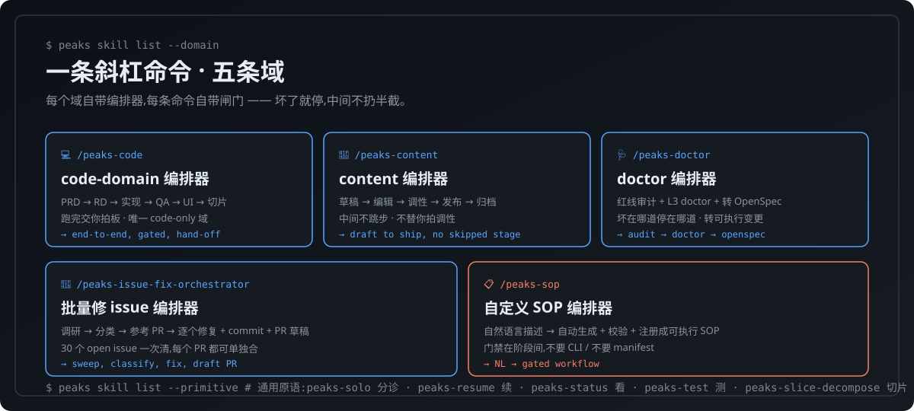
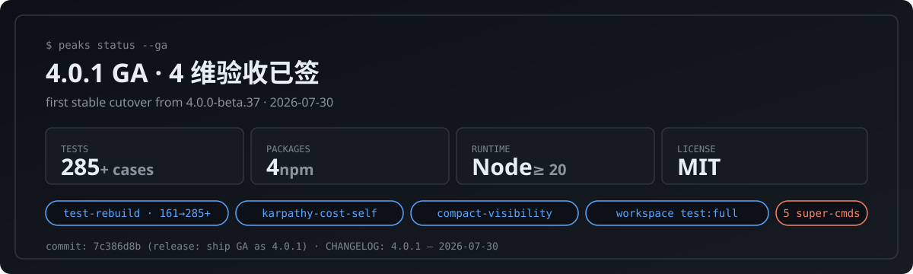

<div align="center">

# peaks-loop

### 你说话,它替你跑完一整条工程流水线 —— 不止写代码,跑两次就沉淀成本地战术。

[](https://www.npmjs.com/package/peaks-loop)
[](https://github.com/SquabbyZ/peaks-loop/actions/workflows/publish.yml)
[](https://github.com/SquabbyZ/peaks-loop/actions/workflows/ci.yml)
[](./LICENSE)
[](https://www.npmjs.com/package/peaks-loop)
[](#status)
[](https://github.com/SquabbyZ/peaks-loop/stargazers)

[English](./README-en.md) · **简体中文**

</div>

<p align="center">
  
</p>

---

## 它是什么

peaks-loop 是一个 **Loop Engineering 结晶系统**,不是工作流工具 —— 你跑过的工作里,沉淀下来的不是「流程」,是一套**可被 karpathy 风格工程化、又被 darwin 风格独立验证**的 Loop Engineering 方法资产。

| 资产层 | 角色 | 一句话 |
| --- | --- | --- |
| **Loop Engineering 资产** | 方法系统,一等公民 | 回答「为什么有这条 loop、何时触发、怎样算成功、如何改进」 |
| **Bee 资产** | 可执行体,一等公民 | Loop Engineering 资产的可执行体,蜂群里的每只 bee |
| **Workflow Trace (执行轨迹)** | 证据,**不是**主资产 | 不可变的单次执行记录,供结晶与评估反查,不是用户对外的产品 |
| **Evolution Evaluation (反漂移)** | 反漂移闸门,强制项 | 每次改进都要有独立上下文的评估者 + 反方怀疑者,过了才留,不过就回滚 |

- **工程化每条规则 = karpathy 风格 · 验证每次改进 = darwin 风格** —— 两条缺一不可。砍掉 karpathy,原则没人写清;砍掉 darwin,改得对不对没人验。这一对是 co-equal 的双层结构,不是先后两步。
- `/peaks-code` 是 **code-domain** 长任务 Loop Engineering 编排器,不是通用编排器;非代码域(`peaks-content` / `peaks-doctor` / `peaks-issue-fix-orchestrator` / `peaks-sop`)都是独立的 `peaks-*` 蜂,不是 `peaks-code` 的子类。
- 跑两次稳定就沉淀成本地战术(bee);跑翻车的会让你重定义。bee 跟着你的口味长。

<p align="center">
  
</p>

---

## 30 秒上手

```bash
npm i -g peaks-loop
```

装好之后,在你已经用的 **Claude Code** 或 **Z Code** 对话框里发一条**显式命令**(必须以斜杠开头,才会触发 peaks-loop):

```
/peaks-code 帮我熟悉下当前的项目
```

剩下的就交给 peaks-loop —— 它会按这条命令的语义判断该走哪一域,用对应的编排器拆工序,一道门一道门跑,**坏在哪道停在哪道**,中间不会扔半截给你。

其他常用的显式命令:

```
/peaks-content                 帮我把今天这篇推文写完发出
/peaks-doctor                  帮我体检一下这个仓库
/peaks-issue-fix-orchestrator  帮我把 upstream 的 30 个 open issue 修一批
/peaks-sop                     帮我把团队的发布流程沉淀成 SOP
/peaks-solo                    这套打法以后还会用,沉淀成本地战术
/peaks-solo                    按上次那样再跑一次
```

<sub>📦 其他 AI 编程工具适配中,欢迎共建 → [GitHub Issues](https://github.com/SquabbyZ/peaks-loop/issues) 提适配请求 / PR。</sub>

不需要记 CLI、不需要写 manifest、不需要切到第二个终端。**斜杠命令一发,后面的活它替你跑完。**

---

## 它能为你做什么

代码、内容、项目健康、issue 修复、自定义工作流 —— **4.x 已经覆盖五条域**,每条域都有专门编排器,按"门禁不通过就停"的纪律一条一条跑。

<p align="center">
  
</p>

| 域 | 你发这条命令 | 它会做什么 |
| --- | --- | --- |
| 💻 **代码域 (code-domain) only** | `/peaks-code 帮我实现这个功能` | PRD → RD → 实现 → QA → UI → 切片,跑完交你拍板 |
| 💻 **代码域 (code-domain) only** | `/peaks-code 这个 bug 帮我修一下` | 复现 → 改 → review → 测试,同日 ship |
| 📝 **内容** | `/peaks-content 帮我把这篇推文写出来再发` | 草稿 → 编辑 → 调性检查 → 发布 → 归档,中间不跳步 |
| 🩺 **项目健康** | `/peaks-doctor 帮我体检一下这个仓库` | 红线审计 + L3 doctor 检查 + 转 OpenSpec,坏在哪道停在哪道 |
| 🐛 **批量修 issue** | `/peaks-issue-fix-orchestrator 帮我把 upstream 的 30 个 open issue 修一批` | 调研 → 分类 → 参考 PR → 逐个修复 + commit + PR 草稿 |
| 📋 **自定义工作流** | `/peaks-sop 帮我把团队的发布流程沉淀成 SOP` | 自然语言描述 → 自动生成 + 校验 + 注册成可执行的 SOP |
| 🔁 **跑过一次再来** | `/peaks-solo 按上次那样再跑一次` | 调出你已经沉淀好的战术,自动复跑 |
| 🆕 **接手陌生仓库** | `/peaks-code 这是新仓库,先带我过一遍` | 摸清结构、识别风险点、给一个上手顺序 |
| 🧠 **沉淀自己的打法** | `/peaks-solo 这套打法以后还会用,沉淀一下` | 变成你本地常驻的战术,下次说"跑那只"就行 |
| 🧪 **开闸审计** | `/peaks-audit` | 6 维审计,RD/QA 前的强制入口 |
| ✅ **4 维验收** | `/peaks-final-review` | 功能/问题/不引入新 bug/不破坏 |
| 🔌 **IDE 适配** | `/peaks-ide` | hooks + statusline + handle |
| ⏯ **从断点续跑** | `/peaks-resume` | 扫最深完成的门,AskUserQuestion |
| 🔬 **切片拆解** | `/peaks-slice-decompose` | 多 pass + 跨 pass 边 + 仲裁 |

每一条路,**一条斜杠命令**就能开跑。

---

## 为什么大家会选它

- **自然语言即界面** —— 你不学 CLI、不背命令。**用一条斜杠命令(比如 `/peaks-code xxx`)** 显式触发到对应编排器,后面说什么都行。LLM 替你跟 peaks-loop 跑命令。
- **门禁真挡事,不是装饰** —— 285+ 测试用例(4 packages 全绿)、QA 闸口、review 验收默认全开。**审计不通过就停,QA 没过就停**。
- **跑过的事会变成本地战术(bee)** —— 沉淀下来的 loop engineering 落到你本地的 `~/.peaks/` 池子里,跑两次稳定就自动晋升;跑翻车的会让你重新定义。**下次说"跑那只"整套流程自动就位**,你那几只战术会跟着你的口味长。
- **搭在你已经用的工具上** —— 不是新发明一个 AI CLI,而是架在 **Claude Code** 和 **Z Code** 之上。不抢你的 shell、不抢你的 prompt、不抢你的 IDE。其他工具适配中,欢迎共建。
- **你拍板,它执行** —— 影响资产的决策都给你选;其余的它自己跑。**0 学习成本,1 分钟上手。**

---

## 装上以后的几道闸门

| 闸门 | 默认状态 | 用来挡什么 |
| --- | --- | --- |
| 单元测试 / 集成测试 | ✅ 开 | 代码层面的回归 |
| 代码审计 (lint / prose / type) | ✅ 开 | 写法与意图漂移 |
| 安全扫描 | ✅ 开 | 凭据、SSRF、注入、危险 IO |
| QA 复核 | ✅ 开 | 任务级闸门,坏在哪道停在哪道 |
| review 验收 | ✅ 开 | 改完不立刻出门,review 通过才出门 |
| 反漂移评估 (Evolution Evaluation) | ✅ 开 | 改进必须过独立评估者 + 反方怀疑者,过不了就回滚 |

**所有闸门默认开,你想关哪一道才需要单独说。**

---

## 当前状态 · 4.0.1 GA

<p align="center">
  
</p>

| | |
| --- | --- |
| **最新版本** | [`4.0.1`](https://github.com/SquabbyZ/peaks-loop/releases) — GA(2026-07-30) |
| **覆盖域** | 代码(`peaks-code`) · 内容(`peaks-content`) · 项目健康(`peaks-doctor`) · 批量修 issue(`peaks-issue-fix-orchestrator`) · 自定义 SOP(`peaks-sop`) · 通用原语(`peaks-solo` 分诊 / `peaks-resume` 续 / `peaks-status` 看 / `peaks-test` 测 / `peaks-slice-decompose` 切片) |
| **沉淀池** | `~/.peaks/` 本地池 · 跑两次自动晋升成 bee · 跑翻车让你重定义 · bee 跟着你的口味长 |
| **测试套件** | 285+ cases · 4 packages (peaks-loop / peaks-loop-mut / peaks-loop-shared-channel / peaks-loop-shared) · 80s 全量 |
| **适配 IDE** | ✅ Claude Code · ✅ Z Code · 🚧 Codex / Cursor / Trae / Tongyi Lingma / Hermes / OpenClaw / Qoder(适配中,欢迎共建) |
| **依赖运行时** | Node ≥ 20 |
| **License** | MIT |

### 4.0.1 GA 这一波实打实修了什么(2026-07-30)

| Epic | 解决的事 | 怎么验 |
| --- | --- | --- |
| **测试体系从零重建** | 旧 559 文件单测卡 3 小时跑不完;现 11 test files / 161 cases 单测已上线,加上子包测试与新增切片,全量 4 packages 285+ cases 全绿,`pnpm test:full` ~80s。删旧断言、写生产合约、4 维分拆(render/behavior/integration/a11y)。 | commit `f17aa377` → `1d6233bc` · `.peaks/memory/2026-07-30-test-rebuild-epic-sediment.md` |
| **Karpathy 评估成本自审** | LLM 在 1-2 个 slice 后不再"今天差不多了明天继续"——`karpathy-reviewer` 报 `costRatio`,>10 时 `peaks job karpathy-cost-check` 自动降级 `block`→`warn`。24h-mode 仍是 override。 | `peaks job karpathy-cost-check --review-file <path>` · 21 cases 单测 |
| **Compact 显性可见** | `peaks compact history` 给 LLM 看本次会话所有 compact 事件;`peaks statusline compact` 单行指示给 IDE 状态栏( `--` / `compact pending (0.85)` / `REDLINE 0.95` / `just compacted (0.92→?)`)。 | `auto-compact-orchestrator` append 到 `compact-history.jsonl` · 19 cases 单测 |
| **子包独立单测 + `pnpm test:full` 覆盖全 workspace** | `peaks-loop-mut` / `peaks-loop-shared-channel` 各自 4 维单测;`peaks-loop-shared` 0 file (passWithNoTests);root 镜像冗余删除。 | commit `593ffcdf` → `08e92d8f` · `pnpm test:full` 一次跑完 4 packages |
| **CLI surface 收敛(73 → 5 super-commands)** | 5 个 super-command(`peaks code / audit / doctor / openspec / release / release-pack`)替换 73 个 leaf command,byte-identical 契约保留,改动对外透明。 | rid-009 · 26 routing test |

---

## 强烈推荐 · 四个项目组合起来用

> **0 学习成本。** 这是组合起来用最大的好处 —— 不只是效果俱佳,更是因为这四个项目的**接口对齐到了"自然语言"**,你只需要说一句话,谁替你跑命令、按什么闸门、按什么战术手册,完全不用你记。

<p align="center">
  
</p>

| 角色 | 项目 | 一句话 |
| --- | --- | --- |
| **结晶与门禁** | [**peaks-loop**](https://github.com/SquabbyZ/peaks-loop) ← 你在这里 | loop engineering 结晶系统,装上就有 PRD/RD/QA/UI/SC/TXT 一整条工程链 + 沉淀 |
| **战术手册** | [affaan-m/ECC](https://github.com/affaan-m/ECC) | everything-claude-code:Claude Code 上能拿到的最好用的战术、技能、SOP 集合 |
| **代码理解** | [Egonex-AI/Understand-Anything](https://github.com/Egonex-AI/Understand-Anything) | 任意仓库,一句话读懂 —— 让 LLM 真正"理解"项目,而不是猜 |
| **流程与纪律** | [obra/superpowers](https://github.com/obra/superpowers) | brainstorming / TDD / debugging / code-review 等流程纪律,每条都自带硬退出条件 |

**用起来就一句话**:把上面三个仓库都 clone 到本地,peaks-loop 装上,剩下的交给 LLM —— 它会按需取用、按纪律守门、按战术落地、按需求沉淀。

### 致敬

peaks-loop 的两条工程脊柱直接来自这两个项目:

- [multica-ai/andrej-karpathy-skills](https://github.com/multica-ai/andrej-karpathy-skills) — 把"工程化每一条规则"刻进我们的方法层。
- [alchaincyf/darwin-skill](https://github.com/alchaincyf/darwin-skill) — 把"演化校验每一次改进"刻进我们的反漂移闸门。

---

## FAQ

<details>
<summary><b>它跟 Claude Code / Z Code 是什么关系?</b></summary>

它是**搭在上面**,不是替换。peaks-loop 不抢你的 shell、不抢你的 prompt、不抢你的 IDE。它在 Claude Code / Z Code 这两个一等公民适配里跑,你照常用。**其他 AI 编程工具适配中,欢迎共建** → [GitHub Issues](https://github.com/SquabbyZ/peaks-loop/issues)。

</details>

<details>
<summary><b>我需要记 CLI 命令吗?</b></summary>

不需要。你只用自然语言或选选项,LLM 替你跑命令。**所有 CLI 命令对外隐藏,对 LLM 开放**。

</details>

<details>
<summary><b>沉淀下来的战术会一直留在本地吗?</b></summary>

会。沉淀落在你本地的池子里,只对你生效。命名、复用、迭代都是你说了算;跑翻车的会让你重新定义。

</details>

<details>
<summary><b>它会自己改我的代码吗?</b></summary>

改,但过门禁。**审计不通过 = 不出门**,**QA 没过 = 不出门**,**review 不通过 = 不出门**。它替你跑,但每道门都给你审。

</details>

<details>
<summary><b>跟 3.x 比,4.x 有什么不同?</b></summary>

**最大的不同:从"代码专用"扩成"多域编排系统"。** 4.x 不再只是写代码 —— 新增了 `peaks-content`(内容生产)、`peaks-doctor`(项目健康)、`peaks-issue-fix-orchestrator`(批量修 issue)、`peaks-sop`(自定义 SOP)四条域编排链,加上 `peaks-solo` 分诊员按你说话自动判断该走哪一域。再加 9 个 IDE 适配、结晶系统重命名、post-run crystallization 机制。完整变更 → [`CHANGELOG.md`](./CHANGELOG.md)。

</details>

<details>
<summary><b>4.0.0 / 4.0.2 这些版本怎么不见了?</b></summary>

它们被 npm 永久 tombstone 了 —— 历史上 published-then-unpublished 的版本号无法再 publish。4.0.1 是首次以 GA 形态落地的版本,完整根因 → `.peaks/memory/2026-07-30-4-0-0-ga-release-flow.md`。

</details>

---

## 全量 skill 索引

13 个 user skill · 全部入口都在 `skills/<name>/SKILL.md`:

`/peaks-code` · `/peaks-content` · `/peaks-doctor` · `/peaks-audit` · `/peaks-final-review` · `/peaks-ide` · `/peaks-issue-fix-orchestrator` · `/peaks-sop` · `/peaks-solo` · `/peaks-resume` · `/peaks-status` · `/peaks-test` · `/peaks-slice-decompose`

---

## Ship 摘要(4.x · 14 rid)

`009 · 010 · 011 · 014 · 015 · 016 · 017 · 020b · 024 · 025 · 026 · 027 · 028 · 029 · 030 · 031 · 032 · 033 · 034` — 涵盖 CLI surface 收敛(73→5 byte-identical)、24h-mode、spillover、DAG fan-out、dashboard 聚合、Trusted Publishing + OIDC、test-rebuild epic、karpathy-cost self-review、compact visibility 等。详见 [`CHANGELOG.md`](./CHANGELOG.md)。

---

## 链接

- 全部技能清单 → [`skills/`](./skills/)
- 更新日志 → [`CHANGELOG.md`](./CHANGELOG.md)
- 提问 → [GitHub Issues](https://github.com/SquabbyZ/peaks-loop/issues)
- 致敬: [multica-ai/andrej-karpathy-skills](https://github.com/multica-ai/andrej-karpathy-skills) · [alchaincyf/darwin-skill](https://github.com/alchaincyf/darwin-skill)
- 组合推荐: [affaan-m/ECC](https://github.com/affaan-m/ECC) · [Egonex-AI/Understand-Anything](https://github.com/Egonex-AI/Understand-Anything) · [obra/superpowers](https://github.com/obra/superpowers)

---

## 关键词 · peaks-loop 在哪里被搜索

> 顺手的查询词,贴在这里方便搜索引擎和 GitHub 内检索命中。

**类别 / Category**:AI orchestration · workflow orchestration · loop engineering · LLM workflow · AI programmer · multi-agent orchestration · AI coding agent · autonomous workflow · AI engineering platform · dev tooling

**CLI / 命令行**:`peaks` · `peaks code` · `peaks audit` · `peaks doctor` · `peaks openspec` · `peaks release` · `peaks release-pack` · `peaks code run` · `peaks code run --24h` · `peaks code detect-job` · `peaks code gate-step-08` · `peaks compact auto` · `peaks compact history` · `peaks job karpathy-cost-check` · `peaks dashboard long-run` · `peaks dashboard summary` · `peaks session 24h-mode` · `peaks sub-agent dispatch` · `peaks worktree spawn` · `peaks worktree auth grant` · `peaks hooks install` · `peaks statusline install` · `peaks standards init` · `peaks openspec archive` · `peaks changeset check` · `peaks mut run` · `peaks mut asserts` · `peaks memory extract` · `peaks workflow verify-pipeline` · `peaks request transition` · `peaks slice check` · `peaks slice decompose` · `peaks resume` · `peaks status` · `peaks test` · `peaks solo`

**斜杠命令 / Slash commands**:`/peaks-code` · `/peaks-content` · `/peaks-doctor` · `/peaks-audit` · `/peaks-final-review` · `/peaks-ide` · `/peaks-issue-fix-orchestrator` · `/peaks-sop` · `/peaks-solo` · `/peaks-resume` · `/peaks-status` · `/peaks-test` · `/peaks-slice-decompose`

**场景 / Use cases**:AI 编程助手 · Claude Code 增强 · Codex 增强 · Z Code 增强 · Cursor 增强 · Trae 增强 · 通义灵码增强 · 24h 通宵编程 · 端到端代码工作流 · 内容生产自动化 · 仓库体检 · 批量修 issue · 自定义 SOP · 沉淀本地战术 · 自然语言编程 · AI 协作开发 · 长期任务编排 · 切片分解 · 子代理派发 · DAG 编排 · 看板监控 · 反漂移评估 · 独立上下文验证 · 演化校验

**工程 / Engineering**:karpathy 风格 · darwin 风格 · TDD · code review · security scan · lint · typecheck · vitest · c8 coverage · mutation testing · Stryker · CI/CD · GitHub Actions · Trusted Publishing · OIDC · changesets · monorepo · pnpm workspace · OpenSpec · apply gate · coverage evidence · 4 维验收 · 4-dim review

**相关项目 / Tributes & recommended**:peaks-loop · SquabbyZ · multica-ai/andrej-karpathy-skills · alchaincyf/darwin-skill · affaan-m/ECC · Egonex-AI/Understand-Anything · obra/superpowers

---

<div align="center">

MIT License · Made by [SquabbyZ](https://github.com/SquabbyZ) · 中文版 · [English version](./README-en.md)

</div>