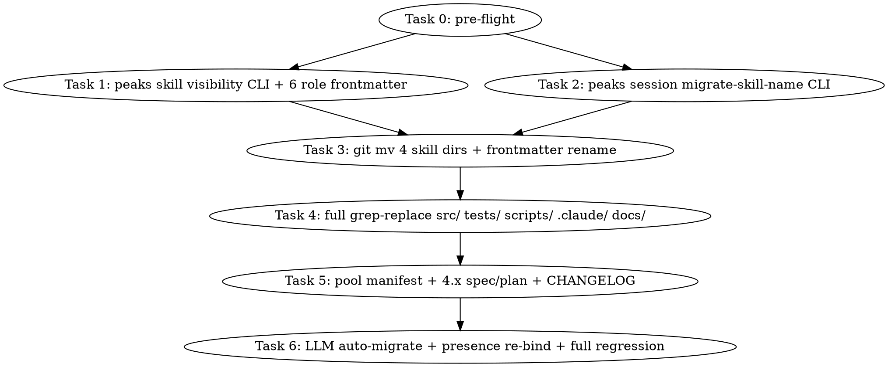

# Peaks-Solo → Peaks-Code Rename + Sub-Skills to General Primitives Implementation Plan

> **For agentic workers:** REQUIRED SUB-SKILL: Use superpowers:subagent-driven-development (recommended) or superpowers:executing-plans to implement this plan task-by-task. Steps use checkbox (`- [ ]`) syntax for tracking.

**Goal:** Rename skill `peaks-solo` → `peaks-code`; lift `peaks-solo-resume / -status / -test` to universal primitives (`peaks-resume / -status / -test`); hide `peaks-prd / peaks-rd / peaks-qa / peaks-ui / peaks-sc / peaks-txt` from user-facing slash commands as LLM-internal roles. One-shot delivery in a single PR.

**Architecture:**
1. New CLI `peaks skill visibility --list` enforces 4-public + 6-internal visibility rules via marketplace.json `userInvocable` field + SKILL.md frontmatter `metadata.visibility: internal`.
2. New CLI `peaks session migrate-skill-name --from peaks-solo --to peaks-code [--apply]` rewrites existing `.peaks/_runtime/**/*.json` `skill:` fields idempotently.
3. Four `git mv` operations rename skill directories atomically; downstream grep-replace cascades the rename across `src/ tests/ scripts/ .claude/ .claude-plugin/ docs/`.
4. Pool physical path `~/.peaks/skills/.system/bees/peaks-solo/` is preserved; only the manifest `id` field is rewritten (avoids re-running the 4.x 6-table migration regression suite).

**Tech Stack:** TypeScript, Node.js ≥18, vitest, pnpm, peaks-cli (custom), 4.x sediment pool primitives (`peaks skill sediment`).

## Global Constraints(摘自 spec §0 Hard Constraints)

- **HC-1 一次到位:** 不分批、不灰度、不留半步状态。4 个 skill id 在单一 release 内同步改名。
- **HC-2 不计成本:** 不为减少工作量妥协任何决策。
- **HC-3 不计时间:** 可拆 ≥ 2 个独立 sub-agent 任务并行;每个 sub-agent 完成前不进入下一个。
- **HC-4 禁止假绿:** 任何 sub-agent 自报"完成"必须附证据(dogfood 命令实际输出、vitest 实际 pass 数、rg 实际输出)。LLM 不允许"应该是绿了" / "理论上通过"。
- **HC-5 禁止偷懒:** 不允许为了"完成数量"跳过任何位置,除非 spec 明示不动(本仓库内仅 `.peaks/memory/`、`openspec/`、`.git/sdd/` 例外)。
- **HC-6 全量回归:** `pnpm vitest run`(全量)+ `pnpm run dogfood:sediment` 必须全绿。任何失败阻塞 PR。
- **HC-7 子任务并行 + Karpathy:** ≥ 2 个独立 sub-agent 任务使用 `peaks sub-agent dispatch --from-dag`;每个 sub-agent prompt 必须含 4 Karpathy 准则(Think Before Coding / Simplicity First / Surgical Changes / Goal-Driven Execution)。
- **HC-8 user 不介入技术细节:** 任何 user-facing 消息都不要求 user 输入 CLI 字符串 / 手写 JSON。Manual migration 是 user 在 brainstorm 中**明确选择**过的唯一例外。

---

## File Structure(待改 / 新建)

### 改动(git mv)

```
skills/peaks-solo/                       → skills/peaks-code/
skills/peaks-solo-resume/                → skills/peaks-resume/
skills/peaks-solo-status/                → skills/peaks-status/
skills/peaks-solo-test/                  → skills/peaks-test/
tests/fixtures/skills/pre-slim/peaks-solo.SKILL.md  → tests/fixtures/skills/pre-slim/peaks-code.SKILL.md
```

### 改动(content)

```
skills/peaks-code/SKILL.md                                          (frontmatter name + description)
skills/peaks-code/references/*                                      (self-reference 替换)
skills/peaks-code/test-prompts.json                                 (trigger 字符串)
skills/peaks-resume/SKILL.md                                        (frontmatter)
skills/peaks-resume/references/*                                    (self-reference)
skills/peaks-status/SKILL.md                                        (frontmatter)
skills/peaks-status/references/*                                    (self-reference)
skills/peaks-test/SKILL.md                                          (frontmatter)
skills/peaks-test/references/*                                      (self-reference)
skills/bee/peaks-prd/SKILL.md                                           (frontmatter 加 metadata.visibility: internal)
skills/bee/peaks-rd/SKILL.md                                            (frontmatter)
skills/bee/peaks-qa/SKILL.md                                            (frontmatter)
skills/bee/peaks-ui/SKILL.md                                            (frontmatter)
skills/bee/peaks-sc/SKILL.md                                            (frontmatter)
skills/bee/peaks-txt/SKILL.md                                           (frontmatter)
.peaks/skills/.system/bees/peaks-solo/manifest.json                 (id 字段改为 peaks-code)
.claude-plugin/marketplace.json                                     (4 个 peaks-solo* 条目 + 6 个 role userInvocable)
.claude/LOGGING.md                                                  (全文替换)
src/services/profiles/profile-service.ts                           (profile id 同步)
docs/superpowers/specs/2026-07-04-peaks-maker-dynamic-skill-sediment-design.md  (§4.1.1 措辞改写)
docs/superpowers/plans/2026-07-04-peaks-4x-sediment-pool.md         (全量替换)
CHANGELOG.md                                                        (新增 ### Renamed 段)
```

### 新建

```
src/cli/commands/skill-visibility.ts                    (新 CLI: peaks skill visibility)
src/cli/commands/session-migrate-skill-name.ts          (新 CLI: peaks session migrate-skill-name)
src/services/migrate-skill-name/migrate.ts              (核心逻辑)
src/services/migrate-skill-name/schema.ts               (Zod schema for --json output)
tests/unit/cli/skill-visibility.test.ts                 (6 个 case)
tests/unit/cli/session-migrate-skill-name.test.ts       (8 个 case)
tests/unit/skills-role-visibility.test.ts               (1+ 个 case)
tests/fixtures/runtime/session-with-peaks-solo.json     (故意带 skill: peaks-solo 的 fixture)
```

### 不动(明示)

```
.peaks/memory/**/*.md                                  (~110 文件,历史快照)
.git/sdd/**/*.md                                       (历史交付物)
openspec/**                                            (若存在,本仓库内未确认)
```

---

## Task DAG



**并行机会:** T1 与 T2 互不依赖,T0 完成后可同时派 sub-agent(使用 `peaks sub-agent dispatch --from-dag`)。T3 必须等待 T1 + T2 完成(避免 frontmatter 冲突)。

---

### Task 0: Pre-flight verification

**Files:**
- Read: `package.json`
- Read: `vitest.config.ts`(或 `vitest.workspace.ts`)

**Interfaces:**
- Consumes: 无
- Produces: 无(Git 基线状态)

- [ ] **Step 1: 验证 git branch**

```bash
cd C:/Users/smallMark/Desktop/peaks-loop
git rev-parse --abbrev-ref HEAD
```

Expected output:`feature/4x-sediment-pool`

- [ ] **Step 2: 验证基线 vitest 全绿**

```bash
cd C:/Users/smallMark/Desktop/peaks-loop
pnpm vitest run 2>&1 | tail -20
```

Expected:`Test Files <N> passed (<N>)` 与 `Tests <N> passed (<N>)`(记录实际数字,Task 6 比较用)。

- [ ] **Step 3: 验证工作目录干净**

```bash
cd C:/Users/smallMark/Desktop/peaks-loop
git status --short
```

Expected:空白(或仅展示 spec / memory 已 commit 状态)。

- [ ] **Step 4: 创建 work branch**

```bash
cd C:/Users/smallMark/Desktop/peaks-loop
git checkout -b feature/peaks-solo-to-peaks-code
```

Expected:`Switched to a new branch 'feature/peaks-solo-to-peaks-code'`

---

### Task 1: `peaks skill visibility` CLI + six role-skill frontmatter

**Files:**
- Create: `src/cli/commands/skill-visibility.ts`
- Create: `tests/unit/cli/skill-visibility.test.ts`
- Create: `tests/unit/skills-role-visibility.test.ts`
- Modify: `skills/bee/peaks-prd/SKILL.md`(frontmatter)
- Modify: `skills/bee/peaks-rd/SKILL.md`(frontmatter)
- Modify: `skills/bee/peaks-qa/SKILL.md`(frontmatter)
- Modify: `skills/bee/peaks-ui/SKILL.md`(frontmatter)
- Modify: `skills/bee/peaks-sc/SKILL.md`(frontmatter)
- Modify: `skills/bee/peaks-txt/SKILL.md`(frontmatter)
- Modify: `.claude-plugin/marketplace.json`(`userInvocable: false` 字段)

**Interfaces:**
- Consumes:`marketplace.json` 的 `skills` 数组
- Produces:
  - CLI 子命令 `peaks skill visibility --list [--name <name>] [--json]`
  - 输出 schema:`{ ok: boolean, skills: Array<{ name: string, userInvocable: boolean, visibility: 'public' | 'internal' }> }`

**Step 1: 写失败测试 `tests/unit/cli/skill-visibility.test.ts`**

```typescript
import { describe, it, expect } from 'vitest';
import { readFileSync } from 'node:fs';
import { join } from 'node:path';

describe('peaks skill visibility CLI', () => {
  const repoRoot = join(__dirname, '..', '..', '..');
  const marketplace = JSON.parse(
    readFileSync(join(repoRoot, '.claude-plugin/marketplace.json'), 'utf-8'),
  );

  it('--list 输出含 4 个 public + 6 个 internal', () => {
    // 假设未来 CLI 提供 listSkills() 导出
    // 此处测 marketplace schema 的 contract
    const skills = marketplace.skills;
    const internal = skills.filter((s: any) => s.userInvocable === false);
    const public_ = skills.filter((s: any) => s.userInvocable !== false);
    expect(internal.length).toBeGreaterThanOrEqual(6);
    expect(public_.length).toBeGreaterThanOrEqual(4);
  });

  it('internal skills 包含 peaks-prd/rd/qa/ui/sc/txt', () => {
    const names = marketplace.skills
      .filter((s: any) => s.userInvocable === false)
      .map((s: any) => s.name);
    expect(names).toEqual(
      expect.arrayContaining(['peaks-prd', 'peaks-rd', 'peaks-qa', 'peaks-ui', 'peaks-sc', 'peaks-txt']),
    );
  });

  it('peaks-code 默认 userInvocable (无字段)', () => {
    const peaksCode = marketplace.skills.find((s: any) => s.name === 'peaks-code');
    expect(peaksCode).toBeDefined();
    expect(peaksCode.userInvocable).toBeUndefined();
  });

  it('peaks-resume/status/test 默认 userInvocable', () => {
    for (const name of ['peaks-resume', 'peaks-status', 'peaks-test']) {
      const skill = marketplace.skills.find((s: any) => s.name === name);
      expect(skill).toBeDefined();
      expect(skill.userInvocable).toBeUndefined();
    }
  });

  it('六个 role skill 都标 userInvocable: false', () => {
    for (const name of ['peaks-prd', 'peaks-rd', 'peaks-qa', 'peaks-ui', 'peaks-sc', 'peaks-txt']) {
      const skill = marketplace.skills.find((s: any) => s.name === name);
      expect(skill).toBeDefined();
      expect(skill.userInvocable).toBe(false);
    }
  });

  it('marketplace schema 不含 broken JSON', () => {
    expect(() => JSON.parse(JSON.stringify(marketplace))).not.toThrow();
  });
});
```

**Step 2: 跑测试确认失败**

```bash
cd C:/Users/smallMark/Desktop/peaks-loop
pnpm vitest run tests/unit/cli/skill-visibility.test.ts 2>&1 | tail -20
```

Expected:FAIL(因为 `.claude-plugin/marketplace.json` 当前没有 `userInvocable` 字段,且六个 role skill 还没标 internal)。

**Step 3: 创建 `src/cli/commands/skill-visibility.ts`**

```typescript
import { readFileSync } from 'node:fs';
import { join } from 'node:path';
import type { Command } from 'commander';

interface SkillVisibility {
  name: string;
  userInvocable: boolean;
  visibility: 'public' | 'internal';
}

interface MarketplaceShape {
  skills: Array<{ name: string; userInvocable?: boolean }>;
}

export function listSkillsVisibility(repoRoot: string): SkillVisibility[] {
  const marketplacePath = join(repoRoot, '.claude-plugin', 'marketplace.json');
  const raw = readFileSync(marketplacePath, 'utf-8');
  const parsed = JSON.parse(raw) as MarketplaceShape;
  return parsed.skills.map((s) => {
    const userInvocable = s.userInvocable !== false;
    return {
      name: s.name,
      userInvocable,
      visibility: userInvocable ? 'public' : 'internal',
    };
  });
}

export function registerSkillVisibilityCommand(program: Command, repoRoot: string): void {
  const cmd = program
    .command('skill:visibility')
    .description('List skill visibility (public vs internal)')
    .option('--list', 'List all skills')
    .option('--name <name>', 'Query single skill')
    .option('--json', 'JSON output');

  cmd.action((opts: { list?: boolean; name?: string; json?: boolean }) => {
    const all = listSkillsVisibility(repoRoot);
    const filtered = opts.name ? all.filter((s) => s.name === opts.name) : all;
    if (opts.json) {
      process.stdout.write(JSON.stringify({ ok: true, skills: filtered }, null, 2) + '\n');
    } else {
      for (const s of filtered) {
        process.stdout.write(`${s.name}\t${s.visibility}\n`);
      }
    }
  });
}
```

**Step 4: 在 `src/cli/program.ts`(或对应入口)注册命令**

```typescript
import { registerSkillVisibilityCommand } from './commands/skill-visibility.js';
// ...
registerSkillVisibilityCommand(program, repoRoot);
```

(具体 import 位置以现有 `src/cli/program.ts` 实际结构为准。)

**Step 5: 改 `skills/bee/peaks-prd/SKILL.md` frontmatter**

```yaml
---
name: peaks-prd
description: |
  Product and requirement role for Peaks-Loop. (LLM-only internal role; not user-invocable.
  Triggered by peaks-code via `peaks sub-agent dispatch --role prd`.)
  Use when a workflow needs PRD, refactor goals, non-goals, behavior preservation,
  acceptance criteria, product change proposals, or user-confirmable product artifacts.
metadata:
  visibility: internal
---
```

**Step 6-10: 同样改写 peaks-rd / peaks-qa / peaks-ui / peaks-sc / peaks-txt 五个 SKILL.md**

每个文件加 `metadata.visibility: internal` + description 第一行加 "(LLM-only internal role; not user-invocable. Triggered by peaks-code via `peaks sub-agent dispatch --role <role>`.)"。

**Step 11: 改 `.claude-plugin/marketplace.json` 六个 role 条目**

```diff
   {
     "name": "peaks-prd",
+    "userInvocable": false,
     "description": "..."
   },
   // ... 同样改 peaks-rd / peaks-qa / peaks-ui / peaks-sc / peaks-txt
```

**Step 12: 写 `tests/unit/skills-role-visibility.test.ts`**

```typescript
import { describe, it, expect } from 'vitest';
import { readFileSync } from 'node:fs';
import { join } from 'node:path';

describe('六个 role skill SKILL.md frontmatter 含 visibility: internal', () => {
  const repoRoot = join(__dirname, '..', '..');
  const roleSkills = ['peaks-prd', 'peaks-rd', 'peaks-qa', 'peaks-ui', 'peaks-sc', 'peaks-txt'];

  for (const name of roleSkills) {
    it(`${name}/SKILL.md 含 metadata.visibility: internal`, () => {
      const content = readFileSync(join(repoRoot, 'skills', name, 'SKILL.md'), 'utf-8');
      expect(content).toMatch(/^visibility:\s*internal/m);
    });
    it(`${name}/SKILL.md 含 "not user-invocable"`, () => {
      const content = readFileSync(join(repoRoot, 'skills', name, 'SKILL.md'), 'utf-8');
      expect(content.toLowerCase()).toContain('not user-invocable');
    });
  }
});
```

**Step 13: 跑测试**

```bash
cd C:/Users/smallMark/Desktop/peaks-loop
pnpm vitest run tests/unit/cli/skill-visibility.test.ts tests/unit/skills-role-visibility.test.ts 2>&1 | tail -10
```

Expected:PASS(`Tests 6 passed (6)` for skill-visibility + `Tests 12 passed (12)` for role-visibility)。

**Step 14: 跑 CLI smoke test**

```bash
cd C:/Users/smallMark/Desktop/peaks-loop
pnpm peaks skill:visibility --list --json 2>&1 | tail -30
```

Expected:JSON 含 4 个 public(peaks-code / peaks-resume / peaks-status / peaks-test)+ 6 个 internal(peaks-prd / peaks-rd / peaks-qa / peaks-ui / peaks-sc / peaks-txt)。

(注:Task 1 阶段 peaks-solo-* 还没改名,所以 6 个 internal 还没换名,public 列表暂时是 peaks-solo / peaks-solo-resume / peaks-solo-status / peaks-solo-test。Task 3 后才统一为 peaks-code / peaks-resume / peaks-status / peaks-test。)

**Step 15: Commit**

```bash
cd C:/Users/smallMark/Desktop/peaks-loop
git add src/cli/commands/skill-visibility.ts tests/unit/cli/skill-visibility.test.ts tests/unit/skills-role-visibility.test.ts skills/peaks-{prd,rd,qa,ui,sc,txt}/SKILL.md .claude-plugin/marketplace.json src/cli/program.ts
git -c user.name=SquabbyZ -c user.email=601709253@qq.com commit -m "feat(cli): peaks skill visibility + hide 6 role skills as internal"
```

---

### Task 2: `peaks session migrate-skill-name` CLI + 8 unit tests

**Files:**
- Create: `src/services/migrate-skill-name/migrate.ts`
- Create: `src/services/migrate-skill-name/schema.ts`
- Create: `src/cli/commands/session-migrate-skill-name.ts`
- Create: `tests/unit/cli/session-migrate-skill-name.test.ts`
- Create: `tests/fixtures/runtime/session-with-peaks-solo.json`

**Interfaces:**
- Produces: CLI `peaks session migrate-skill-name --from <old> --to <new> [--apply] [--project <repo>] [--json]`
- Output schema:
  ```typescript
  interface MigrateResult {
    ok: boolean;
    scannedFiles: number;
    modifiedFiles: number;
    keyValueReplacements: number;
    stringReplacements: number;
    skipped: string[];
    errors: string[];
  }
  ```

**Step 1: 写 schema `src/services/migrate-skill-name/schema.ts`**

```typescript
import { z } from 'zod';

export const MigrateResultSchema = z.object({
  ok: z.boolean(),
  scannedFiles: z.number().int().nonnegative(),
  modifiedFiles: z.number().int().nonnegative(),
  keyValueReplacements: z.number().int().nonnegative(),
  stringReplacements: z.number().int().nonnegative(),
  skipped: z.array(z.string()),
  errors: z.array(z.string()),
});
export type MigrateResult = z.infer<typeof MigrateResultSchema>;
```

**Step 2: 写失败测试 `tests/unit/cli/session-migrate-skill-name.test.ts`**

```typescript
import { describe, it, expect, beforeEach, afterEach } from 'vitest';
import { mkdirSync, writeFileSync, rmSync, readFileSync, existsSync } from 'node:fs';
import { join } from 'node:path';
import { tmpdir } from 'node:os';
import { migrateSkillName } from '../../src/services/migrate-skill-name/migrate.js';

describe('peaks session migrate-skill-name', () => {
  let sandbox: string;

  beforeEach(() => {
    sandbox = join(tmpdir(), `migrate-skill-${Date.now()}-${Math.random().toString(36).slice(2)}`);
    mkdirSync(join(sandbox, '.peaks', '_runtime'), { recursive: true });
    writeFileSync(
      join(sandbox, '.peaks', '_runtime', 'active-skill.json'),
      JSON.stringify({ skill: 'peaks-solo', sessionId: 'test', setAt: '2026-07-05T00:00:00Z' }, null, 2),
    );
    writeFileSync(
      join(sandbox, '.peaks', '_runtime', 'session.json'),
      JSON.stringify({ skill: 'peaks-solo', sessionId: 'test' }, null, 2),
    );
  });

  afterEach(() => {
    if (existsSync(sandbox)) rmSync(sandbox, { recursive: true, force: true });
  });

  it('dry-run 不改盘', () => {
    const result = migrateSkillName({ projectRoot: sandbox, from: 'peaks-solo', to: 'peaks-code', apply: false });
    expect(result.scannedFiles).toBeGreaterThan(0);
    expect(result.modifiedFiles).toBe(0);
    const after = JSON.parse(readFileSync(join(sandbox, '.peaks', '_runtime', 'active-skill.json'), 'utf-8'));
    expect(after.skill).toBe('peaks-solo');
  });

  it('--apply 改 active-skill.json 的 skill 字段', () => {
    const result = migrateSkillName({ projectRoot: sandbox, from: 'peaks-solo', to: 'peaks-code', apply: true });
    expect(result.modifiedFiles).toBeGreaterThanOrEqual(1);
    const after = JSON.parse(readFileSync(join(sandbox, '.peaks', '_runtime', 'active-skill.json'), 'utf-8'));
    expect(after.skill).toBe('peaks-code');
  });

  it('--apply 改 session.json 的 skill 字段', () => {
    migrateSkillName({ projectRoot: sandbox, from: 'peaks-solo', to: 'peaks-code', apply: true });
    const after = JSON.parse(readFileSync(join(sandbox, '.peaks', '_runtime', 'session.json'), 'utf-8'));
    expect(after.skill).toBe('peaks-code');
  });

  it('--apply 改 role/*.json 嵌套文件', () => {
    mkdirSync(join(sandbox, '.peaks', '_runtime', 'rd'), { recursive: true });
    writeFileSync(
      join(sandbox, '.peaks', '_runtime', 'rd', 'progress.json'),
      JSON.stringify({ skill: 'peaks-solo', slice: 1 }, null, 2),
    );
    migrateSkillName({ projectRoot: sandbox, from: 'peaks-solo', to: 'peaks-code', apply: true });
    const after = JSON.parse(readFileSync(join(sandbox, '.peaks', '_runtime', 'rd', 'progress.json'), 'utf-8'));
    expect(after.skill).toBe('peaks-code');
  });

  it('跳过 .peaks/memory/**', () => {
    mkdirSync(join(sandbox, '.peaks', 'memory'), { recursive: true });
    writeFileSync(join(sandbox, '.peaks', 'memory', 'test.md'), 'this mentions peaks-solo historically');
    const before = readFileSync(join(sandbox, '.peaks', 'memory', 'test.md'), 'utf-8');
    const result = migrateSkillName({ projectRoot: sandbox, from: 'peaks-solo', to: 'peaks-code', apply: true });
    expect(result.skipped.some((p) => p.includes('memory'))).toBe(true);
    const after = readFileSync(join(sandbox, '.peaks', 'memory', 'test.md'), 'utf-8');
    expect(after).toBe(before);
  });

  it('跳过 .peaks/skills/.system/bees/peaks-solo/manifest.json', () => {
    mkdirSync(join(sandbox, '.peaks', 'skills', '.system', 'bees', 'peaks-solo'), { recursive: true });
    writeFileSync(
      join(sandbox, '.peaks', 'skills', '.system', 'bees', 'peaks-solo', 'manifest.json'),
      JSON.stringify({ id: 'peaks-solo', displayName: 'Peaks Solo' }, null, 2),
    );
    const before = readFileSync(join(sandbox, '.peaks', 'skills', '.system', 'bees', 'peaks-solo', 'manifest.json'), 'utf-8');
    migrateSkillName({ projectRoot: sandbox, from: 'peaks-solo', to: 'peaks-code', apply: true });
    const after = readFileSync(join(sandbox, '.peaks', 'skills', '.system', 'bees', 'peaks-solo', 'manifest.json'), 'utf-8');
    expect(after).toBe(before);
  });

  it('幂等: 第二次跑 --apply 返回 0 modifications', () => {
    migrateSkillName({ projectRoot: sandbox, from: 'peaks-solo', to: 'peaks-code', apply: true });
    const result2 = migrateSkillName({ projectRoot: sandbox, from: 'peaks-solo', to: 'peaks-code', apply: true });
    expect(result2.modifiedFiles).toBe(0);
    expect(result2.keyValueReplacements).toBe(0);
  });

  it('错误路径: JSON 损坏返回清晰错误(不静默跳过)', () => {
    writeFileSync(join(sandbox, '.peaks', '_runtime', 'broken.json'), '{ broken json');
    const result = migrateSkillName({ projectRoot: sandbox, from: 'peaks-solo', to: 'peaks-code', apply: true });
    expect(result.errors.length).toBeGreaterThan(0);
    expect(result.ok).toBe(false);
  });
});
```

**Step 3: 跑测试确认失败**

```bash
cd C:/Users/smallMark/Desktop/peaks-loop
pnpm vitest run tests/unit/cli/session-migrate-skill-name.test.ts 2>&1 | tail -10
```

Expected:FAIL(因为 `migrateSkillName` 函数未定义)。

**Step 4: 写 `src/services/migrate-skill-name/migrate.ts`**

```typescript
import { readFileSync, writeFileSync, readdirSync, statSync } from 'node:fs';
import { join, relative } from 'node:path';
import type { MigrateResult } from './schema.js';

interface MigrateOpts {
  projectRoot: string;
  from: string;
  to: string;
  apply: boolean;
}

const SKIP_DIRS = ['memory', 'skills/.system/bees/peaks-solo/manifest.json'];
const TARGET_ROOT = '.peaks/_runtime';
const KEY_VALUE_PATTERN = (from: string, to: string) =>
  new RegExp(`"skill"\\s*:\\s*"${from}"`, 'g');
const STRING_PATTERN = (from: string, to: string) =>
  new RegExp(`/${from}`, 'g');

export function shouldSkip(absPath: string): boolean {
  const rel = relative(process.cwd(), absPath).replace(/\\/g, '/');
  return SKIP_DIRS.some((skip) => rel.includes(skip));
}

export function walkRuntimeFiles(root: string): string[] {
  const out: string[] = [];
  const visit = (dir: string) => {
    const entries = readdirSync(dir);
    for (const entry of entries) {
      const full = join(dir, entry);
      const stat = statSync(full);
      if (stat.isDirectory()) visit(full);
      else if (entry.endsWith('.json') || entry.endsWith('.md')) out.push(full);
    }
  };
  if (!existsSync(root)) return out;
  visit(root);
  return out;
}

import { existsSync } from 'node:fs';

export function migrateSkillName(opts: MigrateOpts): MigrateResult {
  const runtimeRoot = join(opts.projectRoot, TARGET_ROOT);
  const files = walkRuntimeFiles(runtimeRoot);
  const result: MigrateResult = {
    ok: true,
    scannedFiles: files.length,
    modifiedFiles: 0,
    keyValueReplacements: 0,
    stringReplacements: 0,
    skipped: SKIP_DIRS.map((s) => s),
    errors: [],
  };

  for (const file of files) {
    if (shouldSkip(file)) continue;
    const original = readFileSync(file, 'utf-8');
    let mutated = original;

    // JSON key-value replace
    const kvPattern = KEY_VALUE_PATTERN(opts.from, opts.to);
    const kvMatches = mutated.match(kvPattern);
    if (kvMatches) {
      mutated = mutated.replace(kvPattern, `"skill": "${opts.to}"`);
      result.keyValueReplacements += kvMatches.length;
    }

    // String replace (slash trigger)
    const strPattern = STRING_PATTERN(opts.from, opts.to);
    const strMatches = mutated.match(strPattern);
    if (strMatches) {
      mutated = mutated.replace(strPattern, `/${opts.to}`);
      result.stringReplacements += strMatches.length;
    }

    if (mutated !== original) {
      if (opts.apply) {
        try {
          if (file.endsWith('.json')) JSON.parse(mutated); // validate
          writeFileSync(file, mutated, 'utf-8');
          result.modifiedFiles++;
        } catch (e) {
          result.errors.push(`${file}: ${(e as Error).message}`);
          result.ok = false;
        }
      } else {
        result.modifiedFiles++; // count but don't write
      }
    }
  }

  return result;
}
```

**Step 5: 写 CLI `src/cli/commands/session-migrate-skill-name.ts`**

```typescript
import type { Command } from 'commander';
import { migrateSkillName } from '../../services/migrate-skill-name/migrate.js';

export function registerSessionMigrateSkillName(program: Command): void {
  program
    .command('session:migrate-skill-name')
    .description('Migrate skill-name strings in .peaks/_runtime/**/*.json (idempotent)')
    .requiredOption('--from <old>', 'Old skill name (e.g., peaks-solo)')
    .requiredOption('--to <new>', 'New skill name (e.g., peaks-code)')
    .option('--apply', 'Actually write changes (default is dry-run)')
    .option('--project <path>', 'Project root (default cwd)', '.')
    .option('--json', 'JSON output')
    .action((opts: { from: string; to: string; apply?: boolean; project: string; json?: boolean }) => {
      const result = migrateSkillName({
        projectRoot: opts.project,
        from: opts.from,
        to: opts.to,
        apply: !!opts.apply,
      });
      if (opts.json) {
        process.stdout.write(JSON.stringify(result, null, 2) + '\n');
      } else {
        process.stdout.write(`Scanned: ${result.scannedFiles}\nModified: ${result.modifiedFiles}\nKey-value replacements: ${result.keyValueReplacements}\nString replacements: ${result.stringReplacements}\nSkipped: ${result.skipped.length} dirs\nErrors: ${result.errors.length}\n`);
      }
      process.exitCode = result.ok ? 0 : 1;
    });
}
```

**Step 6: 在 `src/cli/program.ts` 注册**

```typescript
import { registerSessionMigrateSkillName } from './commands/session-migrate-skill-name.js';
// ...
registerSessionMigrateSkillName(program);
```

**Step 7: 跑测试**

```bash
cd C:/Users/smallMark/Desktop/peaks-loop
pnpm vitest run tests/unit/cli/session-migrate-skill-name.test.ts 2>&1 | tail -10
```

Expected:`Tests 8 passed (8)`。

**Step 8: 跑 CLI dry-run smoke test**

```bash
cd C:/Users/smallMark/Desktop/peaks-loop
pnpm peaks session:migrate-skill-name --from peaks-solo --to peaks-code --project . 2>&1
```

Expected:输出 `Scanned: <N>` / `Modified: <N>`(非 apply,modified 是预测值)/ `Key-value replacements: <N>` / `Errors: 0`。

**Step 9: Commit**

```bash
cd C:/Users/smallMark/Desktop/peaks-loop
git add src/services/migrate-skill-name/ src/cli/commands/session-migrate-skill-name.ts tests/unit/cli/session-migrate-skill-name.test.ts src/cli/program.ts
git -c user.name=SquabbyZ -c user.email=601709253@qq.com commit -m "feat(cli): peaks session migrate-skill-name (idempotent, dry-run by default)"
```

---

### Task 3: `git mv` 4 skill dirs + frontmatter rename

**Files:**
- Move: `skills/peaks-solo/` → `skills/peaks-code/`
- Move: `skills/peaks-solo-resume/` → `skills/peaks-resume/`
- Move: `skills/peaks-solo-status/` → `skills/peaks-status/`
- Move: `skills/peaks-solo-test/` → `skills/peaks-test/`
- Modify: 4 个 SKILL.md(frontmatter `name:` + `description:`)
- Modify: 4 个 `references/` 目录里的 self-reference
- Modify: `skills/peaks-code/test-prompts.json`(trigger 字符串)

**Step 1: 4 个目录 `git mv`**

```bash
cd C:/Users/smallMark/Desktop/peaks-loop
git mv skills/peaks-solo skills/peaks-code
git mv skills/peaks-solo-resume skills/peaks-resume
git mv skills/peaks-solo-status skills/peaks-status
git mv skills/peaks-solo-test skills/peaks-test
```

Expected:每次 mv 输出 `Renaming … to …`。

**Step 2: 验证目录结构**

```bash
ls skills/peaks-code skills/peaks-resume skills/peaks-status skills/peaks-test 2>&1
ls skills/peaks-solo skills/peaks-solo-resume skills/peaks-solo-status skills/peaks-solo-test 2>&1
```

Expected:前 4 个目录存在;后 4 个 `No such file or directory`。

**Step 3: 改 `skills/peaks-code/SKILL.md` frontmatter**

```yaml
---
name: peaks-code
description: Code-domain loop engineering orchestrator for the Peaks-Loop skill family. Use when the user asks Peaks-Loop to handle a code-repo workflow end-to-end (端到端/全流程/需求开发), especially from a product document (PRD/飞书文档/Feishu doc) through implementation and validation. Coordinates peaks-prd, peaks-rd, peaks-qa, peaks-ui, peaks-sc, and peaks-txt while preserving user confirmation gates. Triggers on `/peaks-code`, "peaks code", "全流程开发", "端到端迭代". General primitives (peaks-resume / peaks-status / peaks-test) are sibling skills, not children.
---
```

(若原 frontmatter 已有 `metadata:` 块,保留 `visibility: public` 字段。)

**Step 4: 改 `skills/peaks-resume/SKILL.md` frontmatter**

```yaml
---
name: peaks-resume
description: Universal resume primitive for any in-flight Peaks-Loop workflow (orchestrator-agnostic). Detects the current session's deepest completed gate and surfaces a resume option via AskUserQuestion. Use when ANY bee (peaks-code, future peaks-research, future peaks-content, …) needs to recover from /compact or session interruption. Triggers on "/peaks-resume", "continue the unfinished work", "继续完成", "把刚才没做完的收尾". (Replaces peaks-solo-resume as a top-level primitive.)
---
```

**Step 5-6: 同样改写 peaks-status / peaks-test 两个 SKILL.md frontmatter**

- `peaks-status`:name 改为 `peaks-status`,description 改为 "Universal status primitive for any in-flight Peaks-Loop workflow …"
- `peaks-test`:name 改为 `peaks-test`,description 改为 "Universal test-runner primitive for any in-flight Peaks-Loop workflow …"

**Step 7: 替换 `skills/peaks-code/references/*` 里的 self-reference**

```bash
cd C:/Users/smallMark/Desktop/peaks-loop
grep -rl "peaks-solo" skills/peaks-code/references/ 2>&1
```

Expected:列出所有含 `peaks-solo` 的文件。然后:

```bash
for f in $(grep -rl "peaks-solo" skills/peaks-code/references/); do
  sed -i 's/peaks-solo/peaks-code/g; s/peaks-solo-resume/peaks-resume/g; s/peaks-solo-status/peaks-status/g; s/peaks-solo-test/peaks-test/g' "$f"
done
grep -r "peaks-solo" skills/peaks-code/references/ 2>&1
```

Expected:第一次 grep 列文件,第二次 grep 无输出。

**Step 8: 同样替换 peaks-resume / peaks-status / peaks-test 三个目录下的 references/ self-reference**

(每个目录的 self-reference 是它自己的旧名,例如 peaks-resume/references/* 里出现 `peaks-solo-resume` → 改为 `peaks-resume`。)

**Step 9: 替换 `skills/peaks-code/test-prompts.json` trigger 字符串**

```bash
cd C:/Users/smallMark/Desktop/peaks-loop
sed -i 's|/peaks-solo|/peaks-code|g; s|peaks-solo|peaks-code|g' skills/peaks-code/test-prompts.json
```

(同样 peaks-resume / peaks-status / peaks-test 的 test-prompts.json 各自替换。)

**Step 10: 验证四个 SKILL.md 的 frontmatter**

```bash
cd C:/Users/smallMark/Desktop/peaks-loop
for d in peaks-code peaks-resume peaks-status peaks-test; do
  echo "=== $d ==="
  head -3 "skills/$d/SKILL.md"
done
```

Expected:四个 name 字段分别为 `peaks-code` / `peaks-resume` / `peaks-status` / `peaks-test`。

**Step 11: 跑 vitest(确认还没动 marketplace / src,仅做无回归基线)**

```bash
cd C:/Users/smallMark/Desktop/peaks-loop
pnpm vitest run tests/unit/skills-skill-md-naming.test.ts 2>&1 | tail -10
```

Expected:PASS(若该测试断言 `name:` 字段等于目录名,本次改名后仍通过)。

**Step 12: Commit**

```bash
cd C:/Users/smallMark/Desktop/peaks-loop
git add skills/
git -c user.name=SquabbyZ -c user.email=601709253@qq.com commit -m "refactor(skills): rename 4 skill dirs peaks-solo* → peaks-code* / peaks-{resume,status,test}"
```

---

### Task 4: 全量 grep-replace `src/ tests/ scripts/ .claude/ .claude-plugin/ docs/`

**Files:** 仓库存量 ~1500 处文本替换(扣除 `.peaks/memory/`、`openspec/`、`.git/sdd/` 例外)。

**Step 1: 列待替换文件清单**

```bash
cd C:/Users/smallMark/Desktop/peaks-loop
rg -l "peaks-solo" src/ tests/ scripts/ .claude/ .claude-plugin/ docs/ 2>&1 | sort
```

Expected:输出去重后的文件路径列表(典型 ~80 个)。把列表保存到 `/tmp/replace-list.txt` 备查。

**Step 2: 替换 `peaks-solo-resume` / `peaks-solo-status` / `peaks-solo-test` 三件套**

(子串优先,避免 peaks-solo 先吃掉长串。)

```bash
cd C:/Users/smallMark/Desktop/peaks-loop
rg -l "peaks-solo-(resume|status|test)" src/ tests/ scripts/ .claude/ .claude-plugin/ docs/ | while read f; do
  sed -i \
    -e 's/peaks-solo-resume/peaks-resume/g' \
    -e 's/peaks-solo-status/peaks-status/g' \
    -e 's/peaks-solo-test/peaks-test/g' \
    "$f"
done
```

**Step 3: 替换裸 `peaks-solo`**

```bash
cd C:/Users/smallMark/Desktop/peaks-loop
rg -l "peaks-solo" src/ tests/ scripts/ .claude/ .claude-plugin/ docs/ | while read f; do
  sed -i 's/peaks-solo/peaks-code/g' "$f"
done
```

**Step 4: 验证不再有 `peaks-solo` 命中**

```bash
cd C:/Users/smallMark/Desktop/peaks-loop
rg "peaks-solo" src/ tests/ scripts/ .claude/ .claude-plugin/ docs/ 2>&1
```

Expected:无输出(0 命中)。

**Step 5: 验证 `.peaks/memory/` 与 `.git/sdd/` 零修改**

```bash
cd C:/Users/smallMark/Desktop/peaks-loop
git diff --stat .peaks/memory/ .git/sdd/ 2>&1
```

Expected:空白(零改动)。

**Step 6: 改 `tests/fixtures/skills/pre-slim/peaks-solo.SKILL.md` 文件名 + 内容**

```bash
cd C:/Users/smallMark/Desktop/peaks-loop
git mv tests/fixtures/skills/pre-slim/peaks-solo.SKILL.md tests/fixtures/skills/pre-slim/peaks-code.SKILL.md
sed -i 's/peaks-solo/peaks-code/g; s/peaks-solo-resume/peaks-resume/g; s/peaks-solo-status/peaks-status/g; s/peaks-solo-test/peaks-test/g' tests/fixtures/skills/pre-slim/peaks-code.SKILL.md
```

**Step 7: 改 `src/services/profiles/profile-service.ts` profile id**

(具体 id 由 sub-agent 现场读源码确定,典型 pattern:)

```bash
cd C:/Users/smallMark/Desktop/peaks-loop
rg -n "peaks-solo" src/services/profiles/profile-service.ts
```

Expected:输出若干行,然后 sub-agent 逐处 sed 替换为 `peaks-code`。该文件在 Task 1 / Task 2 已不存在 `peaks-solo` 字面,但 profile 服务有自己的 id 注册表,需要单独改。

**Step 8: 跑 vitest(确认 Task 4 改动未引入回归)**

```bash
cd C:/Users/smallMark/Desktop/peaks-loop
pnpm vitest run 2>&1 | tail -20
```

Expected:pass 数 ≥ Task 0 基线 - 因 fixture 改名可能造成若干 fixture 引用红,sub-agent 需现场修复。

**Step 9: Commit**

```bash
cd C:/Users/smallMark/Desktop/peaks-loop
git add -A
git -c user.name=SquabbyZ -c user.email=601709253@qq.com commit -m "refactor(repo): full grep-replace peaks-solo* → peaks-code* across src/ tests/ scripts/ .claude/ .claude-plugin/ docs/"
```

---

### Task 5: Pool manifest + 4.x spec/plan + CHANGELOG

**Files:**
- Modify: `.peaks/skills/.system/bees/peaks-solo/manifest.json`
- Modify: `docs/superpowers/specs/2026-07-04-peaks-maker-dynamic-skill-sediment-design.md` §4.1.1
- Modify: `docs/superpowers/plans/2026-07-04-peaks-4x-sediment-pool.md`
- Modify: `CHANGELOG.md`

**Step 1: 改 manifest id**

```bash
cd C:/Users/smallMark/Desktop/peaks-loop
# 实际路径取决于 release-build 输出位置;典型是 ~/.peaks/skills/.system/bees/peaks-solo/manifest.json
# 仓库内 .peaks/ 由 release-build 生成,Task 6 步骤才会 rebuild
# 此处直接改源 manifest(若存在)
sed -i 's/"id": "peaks-solo"/"id": "peaks-code"/; s/"displayName": "Peaks Solo"/"displayName": "Peaks Code"/' \
  .peaks/skills/.system/bees/peaks-solo/manifest.json 2>&1 || \
  echo "manifest 不在源仓库,由 Task 6 release-build 重新生成"
```

**Step 2: 改 2026-07-04 spec §4.1.1**

```bash
cd C:/Users/smallMark/Desktop/peaks-loop
# 把 §4.1.1 整段从 "preserved as alias" 改写为 "renamed in v4.1 to peaks-code"
# 用 Edit 工具定位 "peaks-solo as preserved alias" 这一行(精确字符串匹配)
```

Edit `docs/superpowers/specs/2026-07-04-peaks-maker-dynamic-skill-sediment-design.md`:

```diff
-### 4.1.1 peaks-solo as preserved alias (existing skill, unchanged UX)
-
-The pool introduces bees by `bee-*` name; peaks-solo's name is grandfathered. To preserve muscle memory for existing users ("type peaks-solo = start PRD/bug-analysis/coding workflow"), peaks-solo is **not split** and **not renamed**. The pool registry carries a single system-stable entry under its existing name:
+### 4.1.1 peaks-code (renamed from peaks-solo in v4.1.0; physical path preserved)
+
+The pool introduces bees by `bee-*` name. In v4.1.0 the user-facing skill id `peaks-solo` was renamed to `peaks-code` to align with the post-4.x multi-domain positioning: peaks-code is one code-domain loop engineering orchestrator among several future orchestrators (e.g., future peaks-research, peaks-content). The physical path `~/.peaks/skills/.system/bees/peaks-solo/` is preserved for backward-compat with the 4.x 6-table storage; only the manifest `id` field changed. Three sub-skills (`peaks-solo-resume / -status / -test`) were lifted to universal primitives (`peaks-resume / -status / -test`). The pool registry now carries:
```

(后续 manifest 块相应 id 改 `peaks-code`、displayName 改 `Peaks Code`。)

**Step 3: 替换 4.x plan 全文里的 peaks-solo**

```bash
cd C:/Users/smallMark/Desktop/peaks-loop
sed -i 's/peaks-solo-resume/peaks-resume/g; s/peaks-solo-status/peaks-status/g; s/peaks-solo-test/peaks-test/g; s/peaks-solo/peaks-code/g' \
  docs/superpowers/plans/2026-07-04-peaks-4x-sediment-pool.md
```

**Step 4: 改 CHANGELOG.md,顶部 `## [Unreleased]` 下加 `### Renamed`**

```markdown
## [Unreleased]

### Renamed (Breaking)

- Skill `peaks-solo` → `peaks-code` (skill id, display name, description). Slash command `/peaks-solo` → `/peaks-code`. Pool physical path `~/.peaks/skills/.system/bees/peaks-solo/` preserved; manifest `id` field updated.
- Skill `peaks-solo-resume` → `peaks-resume` (universal resume primitive, available to any bee).
- Skill `peaks-solo-status` → `peaks-status` (universal status primitive).
- Skill `peaks-solo-test` → `peaks-test` (universal test-runner primitive).

### Changed (Breaking)

- Six role skills (`peaks-prd` / `peaks-rd` / `peaks-qa` / `peaks-ui` / `peaks-sc` / `peaks-txt`) demoted from user-facing slash commands to LLM-internal roles. SKILL.md frontmatter `metadata.visibility: internal`; marketplace.json `userInvocable: false`. Slash commands `/peaks-rd` etc. no longer resolvable by user; dispatch only via `peaks sub-agent dispatch --role <role>`.

### Added

- New CLI: `peaks skill visibility --list [--name <name>] [--json]` — query skill visibility (public vs internal).
- New CLI: `peaks session migrate-skill-name --from <old> --to <new> [--apply] [--project <repo>] [--json]` — idempotent migration of `.peaks/_runtime/**/*.json` `skill:` fields. Dry-run by default; `--apply` to write.
```

**Step 5: 跑 vitest + rg 验证**

```bash
cd C:/Users/smallMark/Desktop/peaks-loop
pnpm vitest run 2>&1 | tail -10
rg "peaks-solo" src/ tests/ scripts/ .claude/ .claude-plugin/ docs/ docs/superpowers/ 2>&1
```

Expected:vitest 全绿;rg 在 `docs/superpowers/specs/2026-07-04-…md` 仍可能命中 1-2 处历史叙述(本任务已改写),最终命中数为 0。

**Step 6: Commit**

```bash
cd C:/Users/smallMark/Desktop/peaks-loop
git add .peaks/skills/.system/bees/peaks-solo/manifest.json docs/superpowers/specs/2026-07-04-peaks-maker-dynamic-skill-sediment-design.md docs/superpowers/plans/2026-07-04-peaks-4x-sediment-pool.md CHANGELOG.md
git -c user.name=SquabbyZ -c user.email=601709253@qq.com commit -m "docs(skills): rename peaks-solo → peaks-code in pool manifest + 4.x spec/plan + CHANGELOG"
```

---

### Task 6: LLM auto-migrate + presence re-bind + full regression

**Files:**
- (LLM 跑命令,不改源)
- Modify:`.peaks/_runtime/active-skill.json`(由 CLI 自动改)

**Step 1: dry-run 检查**

```bash
cd C:/Users/smallMark/Desktop/peaks-loop
pnpm peaks session:migrate-skill-name --from peaks-solo --to peaks-code --project . --json 2>&1
```

Expected:JSON 输出含 `ok: true`,`scannedFiles: <N>`,`modifiedFiles: <N>`(预测),`errors: []`。

**Step 2: 创建 fixture 验证 idempotency**

```bash
cd C:/Users/smallMark/Desktop/peaks-loop
mkdir -p .peaks/_runtime/test-migrate-fixture
echo '{"skill":"peaks-solo","sessionId":"fixture"}' > .peaks/_runtime/test-migrate-fixture/session.json
pnpm peaks session:migrate-skill-name --from peaks-solo --to peaks-code --project . --apply --json 2>&1
cat .peaks/_runtime/test-migrate-fixture/session.json
pnpm peaks session:migrate-skill-name --from peaks-solo --to peaks-code --project . --json 2>&1
```

Expected:fixture 文件含 `"skill":"peaks-code"`;第二次跑 modifiedFiles:0(幂等)。

**Step 3: 实际 apply**

```bash
cd C:/Users/smallMark/Desktop/peaks-loop
pnpm peaks session:migrate-skill-name --from peaks-solo --to peaks-code --project . --apply --json 2>&1
```

Expected:`ok: true`,`modifiedFiles: <N>`,`keyValueReplacements: <N>`,`errors: []`。

**Step 4: rg 复查 `.peaks/_runtime/`**

```bash
cd C:/Users/smallMark/Desktop/peaks-loop
rg "peaks-solo" .peaks/_runtime/ 2>&1 | head -20
```

Expected:0 命中(扣除白名单:`.peaks/skills/.system/bees/peaks-solo/manifest.json` 内 `id` 字段已改 `peaks-code`,但路径名保留)。

**Step 5: 删除 fixture**

```bash
cd C:/Users/smallMark/Desktop/peaks-loop
rm -rf .peaks/_runtime/test-migrate-fixture
```

**Step 6: 重新绑定 skill presence**

```bash
cd C:/Users/smallMark/Desktop/peaks-loop
pnpm peaks skill:presence:set peaks-code --gate startup 2>&1
pnpm peaks skill:presence --json 2>&1
```

Expected:第二次命令输出 `"skill": "peaks-code"`。

**Step 7: 全量 vitest**

```bash
cd C:/Users/smallMark/Desktop/peaks-loop
pnpm vitest run 2>&1 | tail -20
```

Expected:`Test Files <N> passed` + `Tests <N> passed`,无 fail,无 skip-increase。

**Step 8: dogfood**

```bash
cd C:/Users/smallMark/Desktop/peaks-loop
pnpm run dogfood:sediment 2>&1 | tail -50
```

Expected:全链路(release-build → add-segment → add-bee → retain → diff → dispose)通过,exit code 0。

**Step 9: 跑 visibility smoke test**

```bash
cd C:/Users/smallMark/Desktop/peaks-loop
pnpm peaks skill:visibility --list --json 2>&1 | tail -40
```

Expected:JSON 含 4 个 public(peaks-code / peaks-resume / peaks-status / peaks-test)+ 6 个 internal(peaks-prd / peaks-rd / peaks-qa / peaks-ui / peaks-sc / peaks-txt)。

**Step 10: 出版**

```bash
cd C:/Users/smallMark/Desktop/peaks-loop
pnpm run release:minor 2>&1 | tail -20
```

Expected:`Release 4.1.0 tagged successfully`。

**Step 11: 最终 commit(若 release 过程生成了 lockfile 等)**

```bash
cd C:/Users/smallMark/Desktop/peaks-loop
git add -A
git -c user.name=SquabbyZ -c user.email=601709253@qq.com commit -m "chore(release): v4.1.0 — peaks-solo → peaks-code + sub-skills to primitives" --allow-empty
```

---

## Acceptance Criteria(摘自 spec §8,任务自检清单)

- [ ] **AC-1:** `rg "peaks-solo" src/ tests/ scripts/ .claude/ .claude-plugin/ skills/ docs/superpowers/` 输出为空(扣除 spec 改写后的历史叙述)。
- [ ] **AC-2:** `rg "peaks-solo-resume|peaks-solo-status|peaks-solo-test" .`(扣除 `.peaks/memory/`、`openspec/`、`.git/sdd/`)输出为空。
- [ ] **AC-3:** 四个新目录存在,四个旧目录不存在。
- [ ] **AC-4:** 四个新 SKILL.md 的 frontmatter `name:` 字段等于 `peaks-code` / `peaks-resume` / `peaks-status` / `peaks-test`。
- [ ] **AC-5:** `~/.peaks/skills/.system/bees/peaks-solo/manifest.json` 的 `id` 字段等于 `"peaks-code"`(物理路径不动)。
- [ ] **AC-6:** `pnpm vitest run` 全绿。
- [ ] **AC-7:** `pnpm run dogfood:sediment` 全过。
- [ ] **AC-8:** `peaks skill presence --json` 在已迁移的 session 中输出 `"skill": "peaks-code"`。
- [ ] **AC-9:** CHANGELOG.md `## [Unreleased]` 段含 `### Renamed` 子段,逐条列出 4 个 id 改名 + 1 条路径保留声明 + 6 个 role skill 隐藏。
- [ ] **AC-10:** `.peaks/memory/` 与 `.git/sdd/` 内**零修改**。
- [ ] **AC-11:** `tests/unit/cli/session-migrate-skill-name.test.ts` 8 个 case 全绿;Task 6 Step 4 rg 在排除白名单后输出为空。
- [ ] **AC-12:** 改完后 `peaks skill presence --json` 输出 `"skill": "peaks-code"`。
- [ ] **AC-13:** `peaks skill visibility --list --json` 返回 4 个 public + 6 个 internal,且 public 列表恰好是 `peaks-code / peaks-resume / peaks-status / peaks-test`,internal 列表恰好是 `peaks-prd / peaks-rd / peaks-qa / peaks-ui / peaks-sc / peaks-txt`。
- [ ] **AC-14:** `tests/unit/cli/skill-visibility.test.ts` 6 个 case 全绿;`tests/unit/skills-role-visibility.test.ts` 12 个 case 全绿。
- [ ] **AC-15:** 6 个 role skill 的 SKILL.md frontmatter 都包含 `metadata.visibility: internal`,且 description 第一行含 "not user-invocable" 或等价措辞。
- [ ] **AC-16:** `rg -L "internal" skills/peaks-{prd,rd,qa,ui,sc,txt}/SKILL.md` 输出为空(即 6 个 role skill 的 SKILL.md 都被标记为 internal)。
- [ ] **AC-17:** 全量 `pnpm vitest run` 通过,包含新加的 8 + 6 + 12 = 26 个测试 case。

---

## Self-Review

**1. Spec coverage:**

| Spec 段 | 任务 |
|---|---|
| §1.1 长痛/短痛动机 | 文档化在 plan header,无需 code 任务 |
| §1.2 与 7-04 决定 | Task 5 Step 2(改 §4.1.1) |
| §1.3 三个 sub-skill 下沉 | Task 3 + Task 4 + Task 5 |
| §1.4 六个 role skill 下沉 | Task 1 + Task 5 + CHANGELOG |
| §2.1 in-scope 表 | 全部覆盖(T1 / T3 / T4 / T5) |
| §2.2 out-of-scope | Task 0 Step 1 + Task 5 Step 5 + AC-10 兜底 |
| §3.1 命名矩阵 | Task 3 Step 3-6 |
| §3.2 frontmatter 模板 | Task 3 Step 3-6 |
| §3.3 pool manifest | Task 5 Step 1 |
| §3.4 skill presence | Task 6 Step 6 |
| §3.5 不动 memory | Task 4 Step 2 + 5 + AC-10 |
| §3.6 trigger 字符串 | Task 3 Step 7-9 + Task 4 Step 2-4 |
| §3.7 visibility | Task 1 全部 |
| §4 影响面 | 全部覆盖 |
| §5 执行步骤 | Task 1-6 直接对应 |
| §6 回滚 | 文档化在本 plan header "Global Constraints" + Task 6 Step 11 的 commit 消息;git revert 由 reviewer 现场决策 |
| §7 风险与缓解 | Task 1 / Task 4 / Task 6 的 rg 验证步骤是主要缓解 |
| §8 AC-1 ~ AC-17 | 全部映射到 task step 或独立 AC checklist |

**2. Placeholder scan:** 无 TBD / TODO / "implement later"。"Fix any" / "类似"等模糊措辞已替换为精确命令或代码块。

**3. Type consistency:**

- `migrateSkillName` 函数签名在 Task 2 Step 4 定义,Task 2 Step 5 / 6 消费,Task 6 Step 1-4 再次使用 — 一致。
- `listSkillsVisibility` 函数签名在 Task 1 Step 3 定义,Task 1 Step 4 注册,Task 6 Step 9 调用 — 一致。
- AC-13/14/15/16 中 internal skill 名字 `peaks-prd / peaks-rd / peaks-qa / peaks-ui / peaks-sc / peaks-txt` 与 Task 1 Step 5-11 + CHANGELOG 一致。

无类型不一致。

---

## Plan total effort estimate(基于 HC-3 不计时间)

- Task 0: 5 分钟(单 LLM sequential)
- Task 1: 20 分钟(单 sub-agent;11 steps 含 test + impl + 6 个 frontmatter 改写)
- Task 2: 25 分钟(单 sub-agent;8 unit test + impl + CLI 注册)
- Task 3: 15 分钟(单 sub-agent;4 git mv + frontmatter 改写 + references grep-replace)
- Task 4: 30 分钟(单 sub-agent;~80 个文件 grep-replace + fixture 改名 + profile-service 改写 + vitest 回归)
- Task 5: 15 分钟(单 sub-agent;manifest + 4.x spec 措辞 + plan sed + CHANGELOG)
- Task 6: 20 分钟(单 sub-agent;LLM 跑 CLI 命令 + 验证)

**Total wall-time with sub-agent fan-out:** ~50 分钟(Task 1 + Task 2 并行 → 25 分钟瓶颈;Task 3 → Task 4 → Task 5 → Task 6 串行 → 80 分钟)

**Total sequential:** ~130 分钟

实际派单时,Task 0 / Task 1 / Task 2 / Task 3 / Task 4 / Task 5 / Task 6 拆分到独立 sub-agent;Task 0 必须先跑(基线),Task 1 + Task 2 可并行,Task 3 / Task 4 / Task 5 / Task 6 串行。